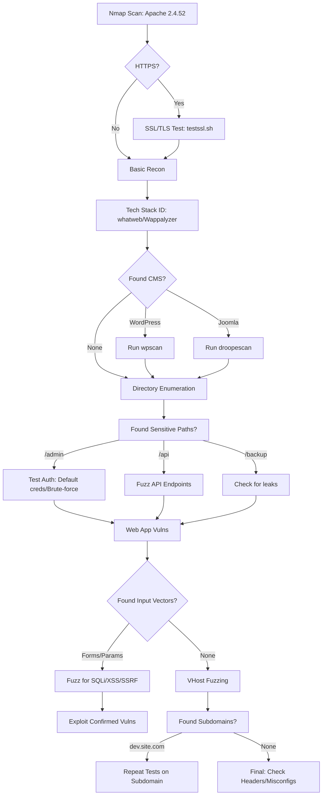

Flowchart for which tests to run on a web server when its found.

```mermaid
graph TD
    A[Nmap Scan: Apache 2.4.52] --> B{HTTPS?}
    B -->|Yes| C[SSL/TLS Test: testssl.sh]
    B -->|No| D[Basic Recon]
    C --> D
    D --> E[Tech Stack ID: whatweb/Wappalyzer]
    E --> F{Found CMS?}
    F -->|WordPress| G[Run wpscan]
    F -->|Joomla| H[Run droopescan]
    F -->|None| I[Directory Enumeration]
    G --> I
    H --> I
    I --> J[Found Sensitive Paths?]
    J -->|/admin| K[Test Auth: Default creds/Brute-force]
    J -->|/api| L[Fuzz API Endpoints]
    J -->|/backup| M[Check for leaks]
    K --> N[Web App Vulns]
    L --> N
    M --> N
    N --> O{Found Input Vectors?}
    O -->|Forms/Params| P[Fuzz for SQLi/XSS/SSRF]
    O -->|None| Q[VHost Fuzzing]
    P --> R[Exploit Confirmed Vulns]
    Q --> S[Found Subdomains?]
    S -->|dev.site.com| T[Repeat Tests on Subdomain]
    S -->|None| U[Final: Check Headers/Misconfigs]
```
