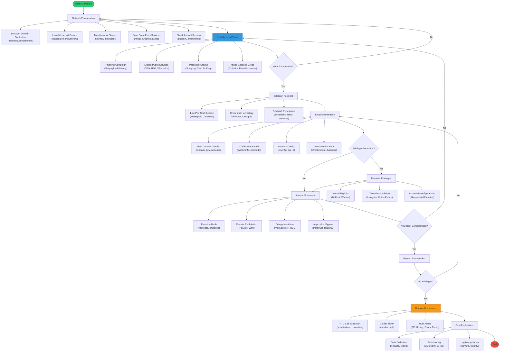

```table-of-contents
```


# Flowchart



# Cheatsheet
```powershell
# Windows/AD Enumeration Cheatsheet
# Post-Exploitation PowerShell Commands

## SYSTEM INFORMATION
# OS and version details
systeminfo
Get-ComputerInfo | Select-Object OsName,OsVersion,OsArchitecture

# Hostname and domain
hostname
[System.Net.Dns]::GetHostName()
(Get-WmiObject Win32_ComputerSystem).Domain
net user /domain
net user {username} /domain
net group /domain
net group "group name" /domain


# Uptime
Get-CimInstance -ClassName Win32_OperatingSystem | Select-Object LastBootUpTime

## USER AND GROUP ENUMERATION
# Current user context
whoami
whoami /priv
whoami /groups

# Local users
Get-LocalUser | Format-Table Name,Enabled,LastLogon
Get-WmiObject -Class Win32_UserAccount | Format-Table Name,Disabled,Status

# Local groups
Get-LocalGroup | Format-Table Name
Get-LocalGroupMember -Group "Administrators" | Format-Table Name,PrincipalSource

## NETWORK CONFIGURATION
# IP addresses and interfaces
Get-NetIPConfiguration | Format-List
Get-NetIPAddress | Format-Table IPAddress,InterfaceAlias

# Network connections
Get-NetTCPConnection | Where-Object {$_.State -eq 'Established'} | Format-Table LocalAddress,LocalPort,RemoteAddress,RemotePort,State

# DNS cache
Get-DnsClientCache | Format-Table EntryName,Data

## PROCESS AND SERVICE ENUMERATION
# Running processes
Get-Process | Format-Table Id,Name,Path
Get-WmiObject Win32_Process | Select-Object Name,ProcessId,CommandLine

# Services
Get-Service | Where-Object {$_.Status -eq 'Running'} | Format-Table Name,DisplayName,StartType
Get-WmiObject Win32_Service | Select-Object Name,PathName,StartName | Where-Object {$_.PathName -notlike "C:\Windows*"}

## SCHEDULED TASKS
Get-ScheduledTask | Where-Object {$_.State -eq 'Ready'} | Format-Table TaskName,TaskPath,State
Get-WmiObject -Namespace "Root\Microsoft\Windows\TaskScheduler" -Class MSFT_ScheduledTask

## INSTALLED SOFTWARE
# Installed programs
Get-ItemProperty HKLM:\Software\Microsoft\Windows\CurrentVersion\Uninstall\* | Select-Object DisplayName,DisplayVersion,Publisher,InstallDate | Format-Table
Get-WmiObject -Class Win32_Product | Select-Object Name,Version

# Patches and updates
Get-HotFix | Sort-Object InstalledOn -Descending | Format-Table HotFixID,InstalledOn

## FILE SYSTEM ENUMERATION
# Interesting files
Get-ChildItem -Path C:\ -Include *pass*,*cred*,*config* -File -Recurse -ErrorAction SilentlyContinue | Select-Object FullName

# Recent files
Get-ChildItem -Path C:\Users\ -Filter *.txt,*.ps1,*.bat,*.vbs -Recurse -ErrorAction SilentlyContinue -File | Where-Object {$_.LastWriteTime -gt (Get-Date).AddDays(-7)} | Select-Object FullName

## ACTIVE DIRECTORY ENUMERATION
# Basic domain info
[System.DirectoryServices.ActiveDirectory.Domain]::GetCurrentDomain()

# Domain users
([adsisearcher]"objectCategory=User").FindAll() | ForEach-Object {$_.Properties}

# Domain groups
([adsisearcher]"objectCategory=Group").FindAll() | ForEach-Object {$_.Properties.name}

# Domain computers
([adsisearcher]"objectCategory=Computer").FindAll() | ForEach-Object {$_.Properties.name}

## CREDENTIAL HUNTING
# Saved credentials
cmdkey /list

# Auto-logon credentials
reg query "HKLM\SOFTWARE\Microsoft\Windows NT\CurrentVersion\Winlogon" /v DefaultUserName
reg query "HKLM\SOFTWARE\Microsoft\Windows NT\CurrentVersion\Winlogon" /v DefaultPassword

# PowerShell history
Get-Content (Get-PSReadlineOption).HistorySavePath

## PRIVILEGE ESCALATION CHECKS
# Unquoted service paths
Get-WmiObject -Class Win32_Service | Where-Object {$_.PathName -like "* *" -and $_.PathName -notlike '"*"*'} | Select-Object Name,PathName

# Service permissions
Get-WmiObject -Class Win32_Service | Where-Object {$_.StartName -match "LocalSystem|LocalService|NetworkService" -eq $false} | Select-Object Name,StartName

## SHARE ENUMERATION
# Local shares
Get-SmbShare | Format-Table Name,Path,Description

# Network shares
net view \\localhost /all
Get-WmiObject -Class Win32_Share | Format-Table Name,Path,Description

## REGISTRY ENUMERATION
# Autoruns
Get-ItemProperty -Path "HKLM:\SOFTWARE\Microsoft\Windows\CurrentVersion\Run"
Get-ItemProperty -Path "HKCU:\SOFTWARE\Microsoft\Windows\CurrentVersion\Run"

# LSA secrets check
reg query "HKLM\SYSTEM\CurrentControlSet\Control\Lsa" /v "JD"
reg query "HKLM\SYSTEM\CurrentControlSet\Control\Lsa" /v "Skew1"
reg query "HKLM\SYSTEM\CurrentControlSet\Control\Lsa" /v "Data"

## MISC CHECKS
# RDP settings
reg query "HKLM\SYSTEM\CurrentControlSet\Control\Terminal Server" /v fDenyTSConnections

# PowerShell version
$PSVersionTable.PSVersion

# AMSI bypass check
[Ref].Assembly.GetType('System.Management.Automation.AmsiUtils').GetField('amsiInitFailed','NonPublic,Static').GetValue($null)
```
