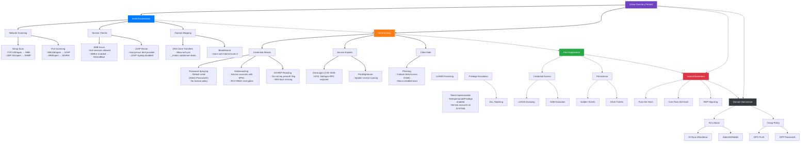

[AD Pentesting Mindmap](https://orange-cyberdefense.github.io/ocd-mindmaps/img/pentest_ad_dark_2022_11.svg)

# Flowchart

```mermaid
flowchart TD
    classDef purple fill:#6f42c1,stroke:#fff,color:#fff
    classDef blue fill:#007bff,stroke:#fff,color:#fff
    classDef orange fill:#fd7e14,stroke:#fff,color:#fff
    classDef green fill:#28a745,stroke:#fff,color:#fff
    classDef red fill:#dc3545,stroke:#fff,color:#fff
    classDef dark fill:#343a40,stroke:#fff,color:#fff

    A[Active Directory Pentest]:::purple

    %% 1. ENUMERATION
    A --> B["Initial Enumeration"]:::blue
    B --> B1["Network Scanning"]
    B1 --> B1a["Nmap Scan<br>- TCP:445/open → SMB<br>- UDP:161/open → SNMP"]
    B1 --> B1b["Port Scanning<br>- 389,636/open → LDAP<br>- 5985/open → WinRM"]

    B --> B2["Service Checks"]
    B2 --> B2a["SMB Enum<br>- Null sessions allowed<br>- SMBv1 enabled → EternalBlue"]
    B2 --> B2b["LDAP Recon<br>- Anonymous bind possible<br>- LDAP signing disabled"]

    B --> B3["Domain Mapping"]
    B3 --> B3a["DNS Zone Transfers<br>- Allow-axfr:yes<br>- _msdcs subdomain leaks"]
    B3 --> B3b["BloodHound<br>- Users with AdminCount=1<br- Excessive ACL rights"]

    %% 2. INITIAL ACCESS
    A --> C["Initial Access"]:::orange
    C --> C1["Credential Attacks"]
    C1 --> C1a["Password Spraying<br>- Default creds (Admin:Password1)<br>- No lockout policy"]
    C1 --> C1b["Kerberoasting<br>- Service accounts with SPNs<br>- RC4-HMAC encryption"]
    C1 --> C1c["AS-REP Roasting<br>- 'Do not req preauth' flag<br>- AES keys missing"]

    C --> C2["Service Exploits"]
    C2 --> C2a["ZeroLogon (CVE-2020-1472)<br- Win Server 2016/2019 DCs<br>- Netlogon RPC exposed"]
    C2 --> C2b["PrintNightmare<br>- Spooler service running<br- Point-and-print enabled"]

    C --> C3["Client-Side"]
    C3 --> C3a["Phishing<br>- Outlook Web Access (OWA)<br>- Macro-enabled docs"]
    C3 --> C3b["LLMNR Poisoning<br- Link-local multicast enabled<br- SMB signing disabled"]

    %% 3. POST-EXPLOITATION
    A --> D["Post-Exploitation"]:::green
    D --> D1["Privilege Escalation"]
    D1 --> D1a["Token Impersonation<br>- SeImpersonatePrivilege enabled<br>- Service accounts as SYSTEM"]
    D1 --> D1b["DLL Hijacking<br- Writeable %PATH% dirs<br- Missing DLLs in ProcMon"]

    D --> D2["Credential Access"]
    D2 --> D2a["LSASS Dumping<br- WDigest enabled<br- LSA protection disabled"]
    D2 --> D2b["SAM Extraction<br- Volume shadow copy allowed<br- Local admin access"]

    D --> D3["Persistence"]
    D3 --> D3a["Golden Tickets<br- KRBTGT hash available<br- Domain SID known"]
    D3 --> D3b["Silver Tickets<br- Service account NTLM hash<br- SPN validation disabled"]

    %% 4. LATERAL MOVEMENT
    A --> E["Lateral Movement"]:::red
    E --> E1["Pass-the-Hash<br- Local admin shares accessible<br- NTLM allowed"]
    E --> E2["Over-Pass-the-Hash<br- RC4 encryption enabled<br- KDC reachable"]
    E --> E3["RDP Hijacking<br- Admin sessions active<br- RestrictedAdmin mode disabled"]

    %% 5. DOMAIN DOMINANCE
    A --> F["Domain Dominance"]:::dark
    F --> F1["ACL Abuse"]
    F1 --> F1a["DCSync Attack<br- Replicating Directory Changes rights<br- KRBTGT hash age >6mo"]
    F1 --> F1b["AdminSDHolder<br- SDProp interval <60min<br- Protected groups modified"]

    F --> F2["Group Policy"]
    F2 --> F2a["GPO Push<br- Write rights on GPOs<br- GPrefresh <90min"]
    F2 --> F2b["GPP Passwords<br- cpassword in Groups.xml<br- SYSVOL readable"]

    %% PHASE CONNECTIONS
    B --> C
    C --> D
    D --> E
    E --> F

    %% STYLING
    linkStyle 0,1,2,3,4,5,6,7,8,9,10,11,12,13,14,15,16,17,18,19 stroke-width:2px
    linkStyle 20,21,22,23 stroke:#fff,stroke-width:2px
```
