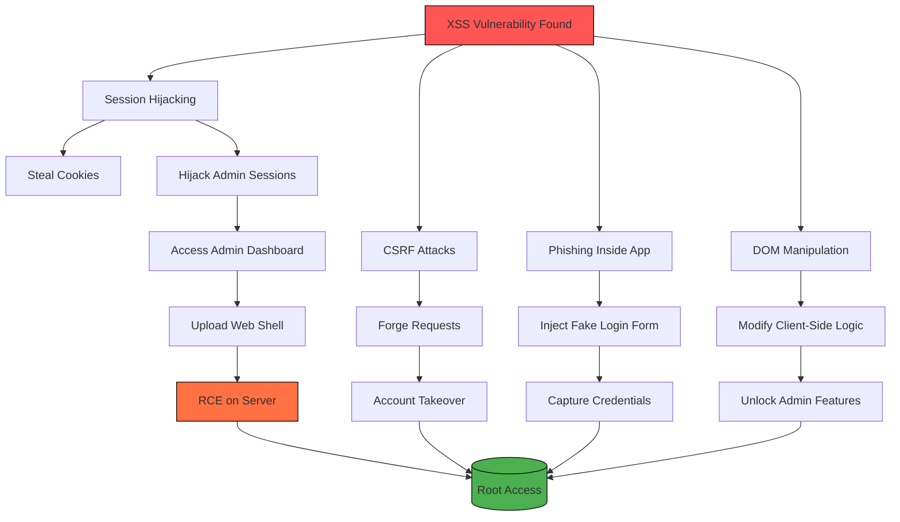

# XSS

```mermaid
flowchart TD
    A[XSS Vulnerability Found] --> B[Session Hijacking]
    A --> C[CSRF Attacks]
    A --> D[Phishing Inside App]
    A --> E[DOM Manipulation]

    B --> B1[Steal Cookies]
    B --> B2[Hijack Admin Sessions]
    B2 --> B2a[Access Admin Dashboard]
    B2a --> B2b[Upload Web Shell]
    B2b --> B2c[RCE on Server]

    C --> C1[Forge Requests]
    C1 --> C2[Account Takeover]

    D --> D1[Inject Fake Login Form]
    D1 --> D2[Capture Credentials]

    E --> E1[Modify Client-Side Logic]
    E1 --> E2[Unlock Admin Features]

    B2c --> F[(Root Access)]
    C2 --> F
    D2 --> F
    E2 --> F

    style A fill:#ff5555,stroke:#000
    style F fill:#4CAF50,stroke:#000
    style B2c fill:#ff7043,stroke:#000
```
