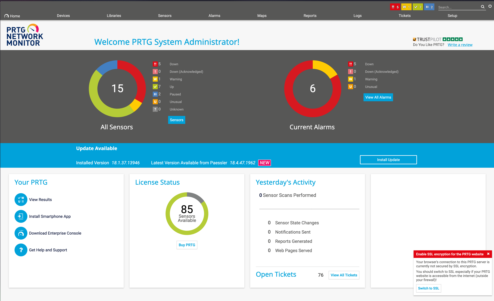

#CTF/HTB/Windows/Easy

# Given

Netmon is an easy difficulty Windows box with simple enumeration and exploitation. PRTG is running, and an FTP server with anonymous access allows reading of PRTG Network Monitor configuration files. The version of PRTG is vulnerable to RCE which can be exploited to gain a SYSTEM shell.

## IP

10.10.10.152

# Steps

## Initial Enumeration

- The first thing to do is to run a full scan of the ip, and see what kind of services are running on it.

```shell fold title:"open ports"
21/tcp    open  ftp          Microsoft ftpd
| ftp-anon: Anonymous FTP login allowed (FTP code 230)
| 02-03-19  12:18AM                 1024 .rnd
| 02-25-19  10:15PM       <DIR>          inetpub
| 07-16-16  09:18AM       <DIR>          PerfLogs
| 02-25-19  10:56PM       <DIR>          Program Files
| 02-03-19  12:28AM       <DIR>          Program Files (x86)
| 02-03-19  08:08AM       <DIR>          Users
|_11-10-23  10:20AM       <DIR>          Windows
| ftp-syst:
|_  SYST: Windows_NT
80/tcp    open  http         Indy httpd 18.1.37.13946 (Paessler PRTG bandwidth monitor)
|_http-trane-info: Problem with XML parsing of /evox/about
| http-title: Welcome | PRTG Network Monitor (NETMON)
|_Requested resource was /index.htm
|_http-server-header: PRTG/18.1.37.13946
135/tcp   open  msrpc        Microsoft Windows RPC
139/tcp   open  netbios-ssn  Microsoft Windows netbios-ssn
445/tcp   open  microsoft-ds Microsoft Windows Server 2008 R2 - 2012 microsoft-ds
5985/tcp  open  http         Microsoft HTTPAPI httpd 2.0 (SSDP/UPnP)
|_http-server-header: Microsoft-HTTPAPI/2.0
|_http-title: Not Found
47001/tcp open  http         Microsoft HTTPAPI httpd 2.0 (SSDP/UPnP)
|_http-server-header: Microsoft-HTTPAPI/2.0
|_http-title: Not Found
49664/tcp open  msrpc        Microsoft Windows RPC
49665/tcp open  msrpc        Microsoft Windows RPC
49666/tcp open  msrpc        Microsoft Windows RPC
49667/tcp open  msrpc        Microsoft Windows RPC
49668/tcp open  msrpc        Microsoft Windows RPC
49669/tcp open  msrpc        Microsoft Windows RPC
```

- The first step would be to look at the site on the open HTTP port. That leads to a login page for the PRTG Network Monitor. We need creds for this.
- The Nmap scan shows us that FTP is open to anonymous logins. Lets try to scan that using nextscan.

```shell title:"Next Scan" fold:true
nxc ftp 10.10.10.152 -u 'anonymous' -p ''
```

## Foothold

- We get into the FTP server, and the user flag is on the desktop.
- Additionally, there's config files for the PRTG Network Monitor that contain login details for the old system administrator.
- The old password for the admin ends in 2018, so perhaps the new one would be 2019? Turns out this works, and we get into the admin panel.
  


## Privesc

- Googling & using searchsploit for`PRTG Network Monitor 18.1.37.13946 exploit` shows us a bunch of exploits. The one that suits our use case is a code injection vulnerability that affects the notifications on the web admin panel.


- To use the exploit, we have to login as the original admin, and then grab the cookies from the site. We then run the exploit code, which creates a new user called `pentest` and adds it to the administrators group.


- To test our creds, we can login to the smb shares, and check our access.


- This shows that we have read/write access to the Admin and C shares.
- Since the port for `msrpc` is open, we can remote in with something like `evil-winrm`

```shell title:"evil winrm"
evil-winrm -i 10.10.10.152 -u pentest -p P3nT3st!
```

- With this login, we can access the Administrator account on the machine, and then look at the admin's desktop to find the root flag.


# Findings

- FTP(22) ports is open and allows anonymous logins
- SMB(445) is open - There's a possibility of using a null session.
- HTTP(80) is hosting a website.
- Config and backup files for PRTG Netmon 18.1.37.13946
- Old login for admin is in one of the backups.

# Creds

- PRTG Configuration.old.bak
	- prtgadmin : PrTg@dmin2018
-  PRTG new login
	- prtgadmin : PrTg@dmin2019

# Flags

- User: d023747c165a5804fce255422e80fb96
- Root: 7efe69344857020b4f7c067c79a5a4e9

# Proof


