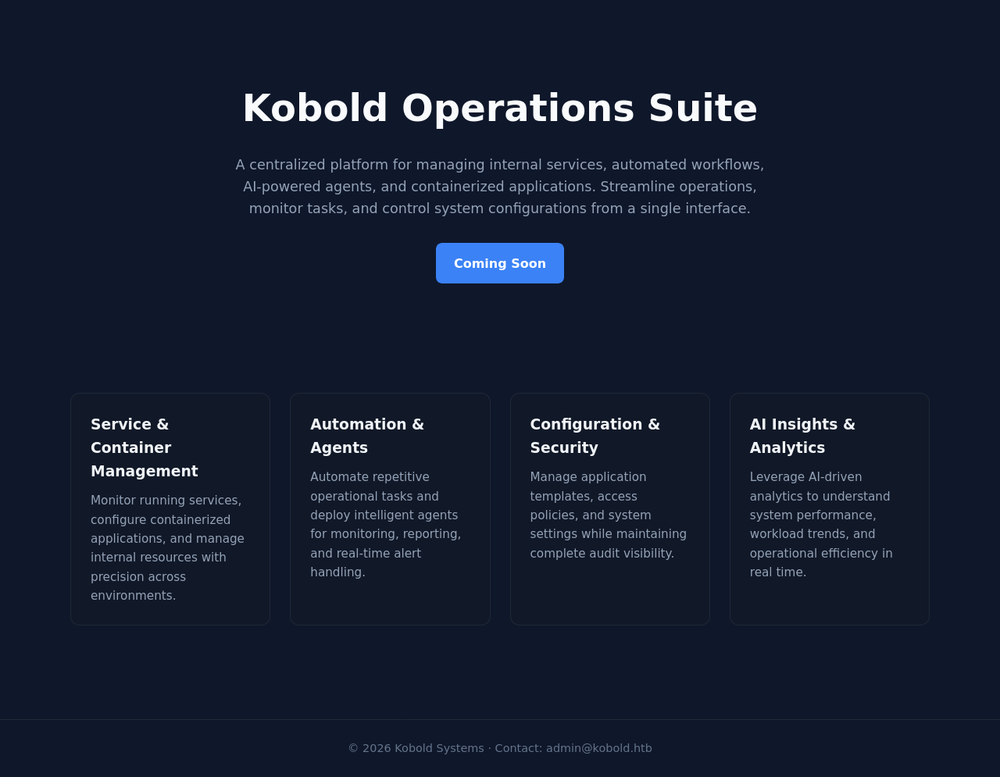
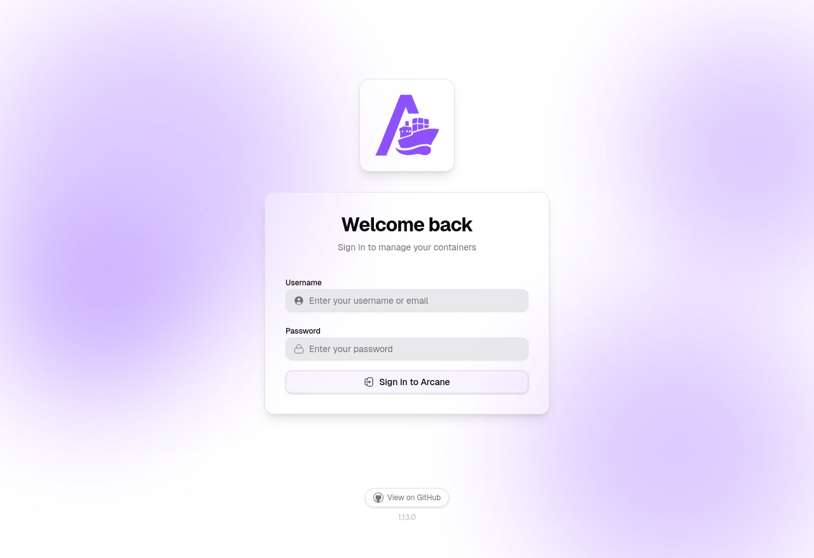
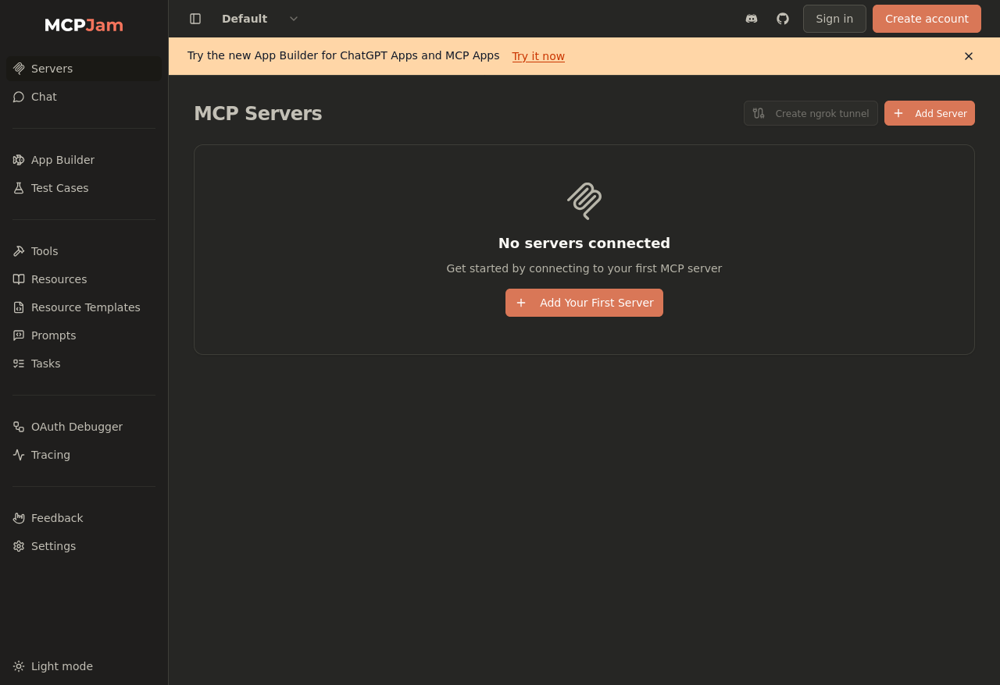

# Scope

# Enumeration

## Ports

```bash
PORT     STATE SERVICE  REASON
22/tcp   open  ssh      syn-ack ttl 63
80/tcp   open  http     syn-ack ttl 63
443/tcp  open  https    syn-ack ttl 63
3552/tcp open  taserver syn-ack ttl 63
```

## Services

```bash
PORT     STATE SERVICE   REASON         VERSION
22/tcp   open  ssh       syn-ack ttl 63 OpenSSH 9.6p1 Ubuntu 3ubuntu13.15 (Ubuntu Linux; protocol 2.0)
| ssh-hostkey:
|   256 8c4512360361de0f0b2bc39b2a9259a1 (ECDSA)
| ecdsa-sha2-nistp256 AAAAE2VjZHNhLXNoYTItbmlzdHAyNTYAAAAIbmlzdHAyNTYAAABBBDyfTq7atQNY2qg78Nt+Q/rowZnmsZ0+vG+FraL750n57MCUNo0a/hw/Df2XfLKPUGiVIVYmQTraVft8Xv2
AjYk=
|   256 d23cbfed554a5213b534d2fb8fe493bd (ED25519)
|_ssh-ed25519 AAAAC3NzaC1lZDI1NTE5AAAAIHDfvijaU/WiU8D/im7cOg8k4NeAOUgCHq16HhCbmZcI
80/tcp   open  http      syn-ack ttl 63 nginx 1.24.0 (Ubuntu)
|_http-server-header: nginx/1.24.0 (Ubuntu)
| http-methods:
|_  Supported Methods: GET HEAD POST OPTIONS
|_http-title: Did not follow redirect to https://kobold.htb/
443/tcp  open  ssl/http  syn-ack ttl 63 nginx 1.24.0 (Ubuntu)
|_http-server-header: nginx/1.24.0 (Ubuntu)
| tls-alpn:
|   http/1.1
|   http/1.0
|_  http/0.9
| ssl-cert: Subject: commonName=kobold.htb
| Subject Alternative Name: DNS:kobold.htb, DNS:*.kobold.htb
| Issuer: commonName=kobold.htb
| Public Key type: rsa
| Public Key bits: 2048
| Signature Algorithm: sha256WithRSAEncryption
| Not valid before: 2026-03-15T15:08:55
| Not valid after:  2125-02-19T15:08:55
| MD5:   c49ec4d5d4a0e47300bc8df8cc0098ac
| SHA-1: a2311d00d15b2007eff5957d0561265abb906906
| -----BEGIN CERTIFICATE-----
| MIIDMjCCAhqgAwIBAgIUYYWyqxUgK9B/KXzRH5Qhz8UlYxkwDQYJKoZIhvcNAQEL
| BQAwFTETMBEGA1UEAwwKa29ib2xkLmh0YjAgFw0yNjAzMTUxNTA4NTVaGA8yMTI1
| MDIxOTE1MDg1NVowFTETMBEGA1UEAwwKa29ib2xkLmh0YjCCASIwDQYJKoZIhvcN
| AQEBBQADggEPADCCAQoCggEBAJ8HVhVl45uBJYRwEQCmzAEXGqJMK6Wp5BOeaSLD
| 6KJjuSnWLOs5vKTtpHvhlulpnwqa7PmTiUUhjY421T2sn2KNRcCFKyNMJ9Ju6lSe
| ijY6oQ2DEED82QC/1HX6O2XtJUf5JWrGrr1krrS6wrHSrEaTwA0vgwrJlVf/TO+U
| 21Mnv3W1lActy7GMfnehOrz0zWDfYjNB/JuOWHEZdRIDALUicaMUgsReZDmBaLH7
| qMBBS7Eid9a15YNIU0FQ297ufai42rD2rDAndGG+eh6eri6DYMVmffBecbOsh4fv
| Li4PTXk3dvO+7+Fnx8YHCYtGTEv1k/R6o/+xQXLsGboQ5P0CAwEAAaN4MHYwHQYD
| VR0OBBYEFGFtHfv+9EMzqZuSryruA41VtTAZMB8GA1UdIwQYMBaAFGFtHfv+9EMz
| qZuSryruA41VtTAZMA8GA1UdEwEB/wQFMAMBAf8wIwYDVR0RBBwwGoIKa29ib2xk
| Lmh0YoIMKi5rb2JvbGQuaHRiMA0GCSqGSIb3DQEBCwUAA4IBAQCQybOVM+Zo5MTb
| QY/24rWy1ksAuiUqPHCABNprilPvsvBGkIMC6aSLqzR8UXm+4aQzBxNlHsePvkzu
| suuQKAoyCbnId0qii6a1vzeozgIOt+1oqfxFe7mRAiLhboSctFqScC6dy/PDEIOg
| bt+gLfU5iKsjqTQBxcWZr4uj7DtWbRC73OITWSSi/Y/AI66o5VHIUhnJ29gOEJVw
| 5Bv43Iublt2FBH/S6fiz509tJAsqLhp1kmxIAWrV92rBZPSpF4s2xWRbWefZPm7L
| fstlVNlXRrBnPz8iN8JrlpZLmZCUQ+BjMUXjqS27LS9Dl/3agD/F2gNuSho/s1F8
| TI93TWcE
|_-----END CERTIFICATE-----
| http-methods:
|_  Supported Methods: GET HEAD POST OPTIONS
|_http-title: Did not follow redirect to https://kobold.htb/
|_ssl-date: TLS randomness does not represent 00:04
3552/tcp open  taserver? syn-ack ttl 63
| fingerprint-strings:
|   GenericLines:
|     HTTP/1.1 400 Bad Request
|     Content-Type: text/plain; charset=utf-8
|     Connection: close
|     Request
|   GetRequest, HTTPOptions:
|     HTTP/1.0 200 OK
|     Accept-Ranges: bytes
|     Cache-Control: no-cache, no-store, must-revalidate
|     Content-Length: 2081
|     Content-Type: text/html; charset=utf-8
|     Expires: 0
|     Pragma: no-cache
|     Date: Fri, 27 Mar 2026 15:58:22 GMT
|     <!doctype html>
|     <html lang="%lang%">
|     <head>
|     <meta charset="utf-8" />
|     <meta http-equiv="Cache-Control" content="no-cache, no-store, must-revalidate" />
|     <meta http-equiv="Pragma" content="no-cache" />
|     <meta http-equiv="Expires" content="0" />
|     <link rel="icon" href="/api/app-images/favicon" />
|     <meta name="viewport" content="width=device-width, initial-scale=1, maximum-scale=1, viewport-fit=cover" />
|     <link rel="manifest" href="/app.webmanifest" />
|     <meta name="theme-color" content="oklch(1 0 0)" media="(prefers-color-scheme: light)" />
|     <meta name="theme-color" content="oklch(0.141 0.005 285.823)" media="(prefers-color-scheme: dark)" />
|_    <link rel="modu
1 service unrecognized despite returning data. If you know the service/version, please submit the following fingerprint at https://nmap.org/cgi-bin/submit.cg
i?new-service :
SF-Port3552-TCP:V=7.93%I=7%D=3/27%Time=69C6A91D%P=aarch64-unknown-linux-gn
SF:u%r(GenericLines,67,"HTTP/1\.1\x20400\x20Bad\x20Request\r\nContent-Type
SF::\x20text/plain;\x20charset=utf-8\r\nConnection:\x20close\r\n\r\n400\x2
SF:0Bad\x20Request")%r(GetRequest,8FF,"HTTP/1\.0\x20200\x20OK\r\nAccept-Ra
SF:nges:\x20bytes\r\nCache-Control:\x20no-cache,\x20no-store,\x20must-reva
SF:lidate\r\nContent-Length:\x202081\r\nContent-Type:\x20text/html;\x20cha
SF:rset=utf-8\r\nExpires:\x200\r\nPragma:\x20no-cache\r\nDate:\x20Fri,\x20
SF:27\x20Mar\x202026\x2015:58:22\x20GMT\r\n\r\n<!doctype\x20html>\n<html\x
SF:20lang=\"%lang%\">\n\t<head>\n\t\t<meta\x20charset=\"utf-8\"\x20/>\n\t\
SF:t<meta\x20http-equiv=\"Cache-Control\"\x20content=\"no-cache,\x20no-sto
SF:re,\x20must-revalidate\"\x20/>\n\t\t<meta\x20http-equiv=\"Pragma\"\x20c
SF:ontent=\"no-cache\"\x20/>\n\t\t<meta\x20http-equiv=\"Expires\"\x20conte
SF:nt=\"0\"\x20/>\n\t\t<link\x20rel=\"icon\"\x20href=\"/api/app-images/fav
SF:icon\"\x20/>\n\t\t<meta\x20name=\"viewport\"\x20content=\"width=device-
SF:width,\x20initial-scale=1,\x20maximum-scale=1,\x20viewport-fit=cover\"\
SF:x20/>\n\t\t<link\x20rel=\"manifest\"\x20href=\"/app\.webmanifest\"\x20/
SF:>\n\t\t<meta\x20name=\"theme-color\"\x20content=\"oklch\(1\x200\x200\)\
SF:"\x20media=\"\(prefers-color-scheme:\x20light\)\"\x20/>\n\t\t<meta\x20n
SF:ame=\"theme-color\"\x20content=\"oklch\(0\.141\x200\.005\x20285\.823\)\
SF:"\x20media=\"\(prefers-color-scheme:\x20dark\)\"\x20/>\n\t\t\n\t\t<link
SF:\x20rel=\"modu")%r(HTTPOptions,8FF,"HTTP/1\.0\x20200\x20OK\r\nAccept-Ra
SF:nges:\x20bytes\r\nCache-Control:\x20no-cache,\x20no-store,\x20must-reva
SF:lidate\r\nContent-Length:\x202081\r\nContent-Type:\x20text/html;\x20cha
SF:rset=utf-8\r\nExpires:\x200\r\nPragma:\x20no-cache\r\nDate:\x20Fri,\x20
SF:27\x20Mar\x202026\x2015:58:22\x20GMT\r\n\r\n<!doctype\x20html>\n<html\x
SF:20lang=\"%lang%\">\n\t<head>\n\t\t<meta\x20charset=\"utf-8\"\x20/>\n\t\
SF:t<meta\x20http-equiv=\"Cache-Control\"\x20content=\"no-cache,\x20no-sto
SF:re,\x20must-revalidate\"\x20/>\n\t\t<meta\x20http-equiv=\"Pragma\"\x20c
SF:ontent=\"no-cache\"\x20/>\n\t\t<meta\x20http-equiv=\"Expires\"\x20conte
SF:nt=\"0\"\x20/>\n\t\t<link\x20rel=\"icon\"\x20href=\"/api/app-images/fav
SF:icon\"\x20/>\n\t\t<meta\x20name=\"viewport\"\x20content=\"width=device-
SF:width,\x20initial-scale=1,\x20maximum-scale=1,\x20viewport-fit=cover\"\
SF:x20/>\n\t\t<link\x20rel=\"manifest\"\x20href=\"/app\.webmanifest\"\x20/
SF:>\n\t\t<meta\x20name=\"theme-color\"\x20content=\"oklch\(1\x200\x200\)\
SF:"\x20media=\"\(prefers-color-scheme:\x20light\)\"\x20/>\n\t\t<meta\x20n
SF:ame=\"theme-color\"\x20content=\"oklch\(0\.141\x200\.005\x20285\.823\)\
SF:"\x20media=\"\(prefers-color-scheme:\x20dark\)\"\x20/>\n\t\t\n\t\t<link
SF:\x20rel=\"modu");
Service Info: OS: Linux; CPE: cpe:/o:linux:linux_kernel
```

## Findings

- The domain name for this box is `kobold.htb`
- There are some vhosts or subdomains given the DNS entry `*.kobold.htb`

## SSH

- There aren't any valid credentials at the moment, skipping this one.

## HTTP

- Opens up a site for a platform that is used to manage internal services
  - 
- Redirects to an HTTPS address.
- But using the URL `http://kobold.htb` goes to a login screen for an app called `Arcane`.
  - 
  - Version is 1.13.0
- DNS entry `*.kobold.htb` that hints at the possibility of virtual hosts/subdomains.
  - Scanning for this with FFUF revealed 2 additional subdomains.

  ```bash
  [Mar 28, 2026 - 00:43:30 (+08)] exegol-htb kobold # ffuf -w `fzf-wordlists` -u "https://kobold.htb" -k -H "Host: FUZZ.kobold.htb" -c -fs 154

      /'___\  /'___\           /'___\
     /\ \__/ /\ \__/  __  __  /\ \__/
     \ \ ,__\\ \ ,__\/\ \/\ \ \ \ ,__\
      \ \ \_/ \ \ \_/\ \ \_\ \ \ \ \_/
       \ \_\   \ \_\  \ \____/  \ \_\
        \/_/    \/_/   \/___/    \/_/

     v2.1.0

    ---

    :: Method : GET
    :: URL : https://kobold.htb
    :: Wordlist : FUZZ: /opt/lists/seclists/Discovery/Web-Content/big.txt
    :: Header : Host: FUZZ.kobold.htb
    :: Follow redirects : false
    :: Calibration : false
    :: Timeout : 10
    :: Threads : 40
    :: Matcher : Response status: 200-299,301,302,307,401,403,405,500
    :: Filter : Response size: 154

    ---

    bin [Status: 200, Size: 24402, Words: 1218, Lines: 386, Duration: 20ms]
    mcp [Status: 200, Size: 466, Words: 57, Lines: 15, Duration: 18ms]
  ```

- `bin.kobold.htb` doesn't lead anywhere
- `mcp.kobold.htb` leads to another dashboard called `MCPJam Dashboard`
  - 
  - version 1.4.2

# Exploits

## Arcane v1.13.0

- The vuln works for versions < 1.13.0.
- So it isn't valid here.

## MCP Jam v1.4.2

- There is an existing command injection vulnerability that leads to RCE: [CVE-2025-23744](https://github.com/advisories/GHSA-232v-j27c-5pp6)
-

# Internal Enumeration

# Privilege Escalation

# Remediation

# Lessons Learnt

```

```
