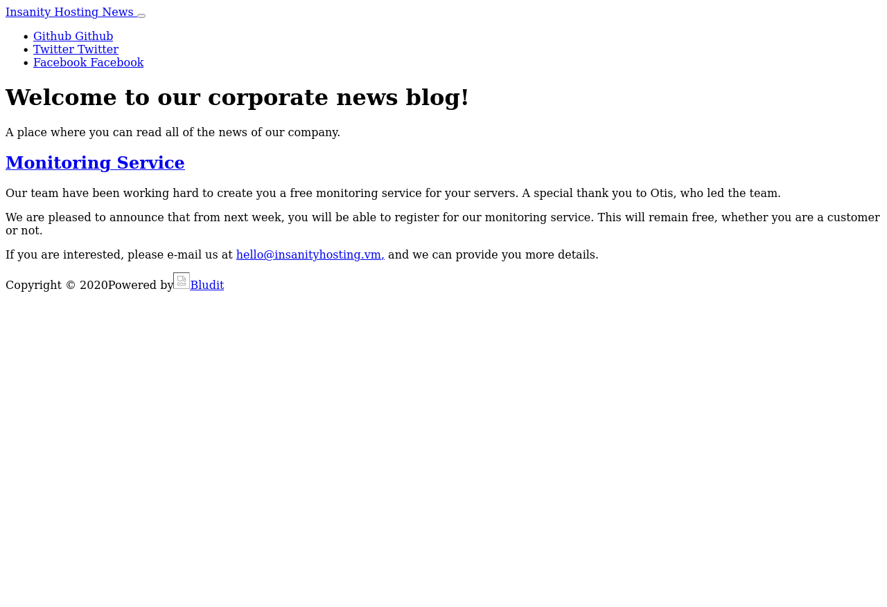
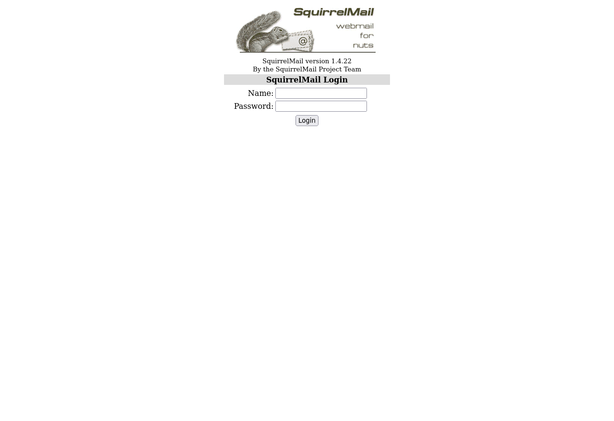
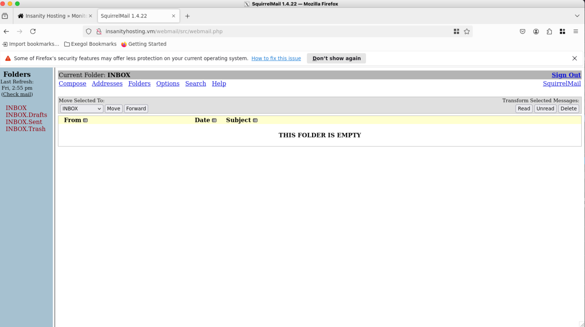
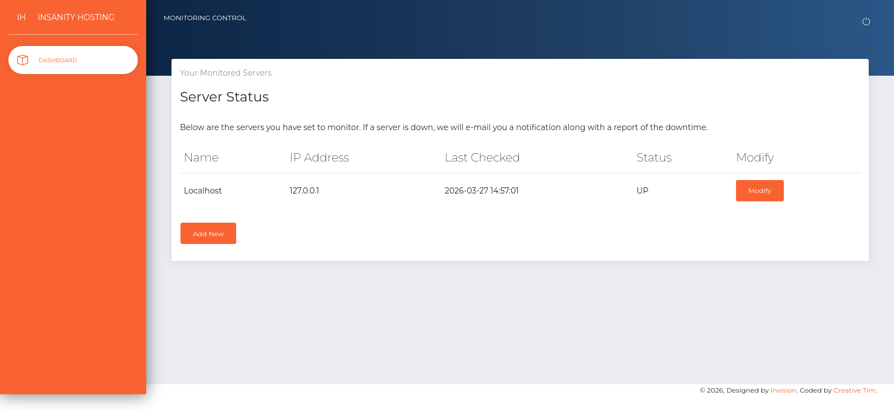
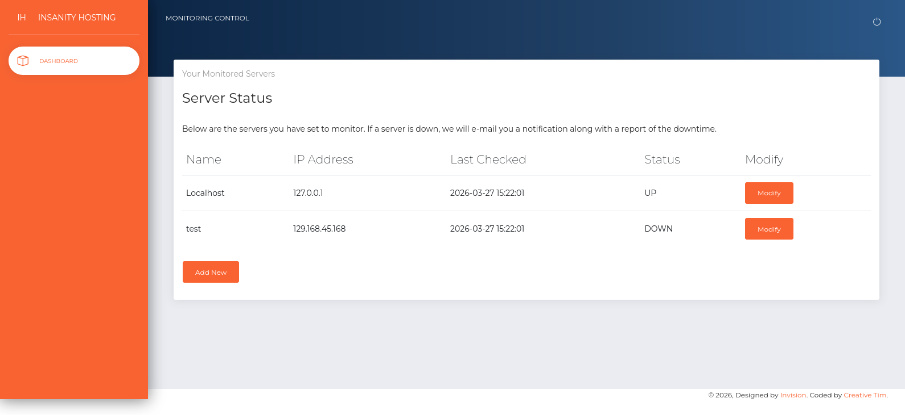
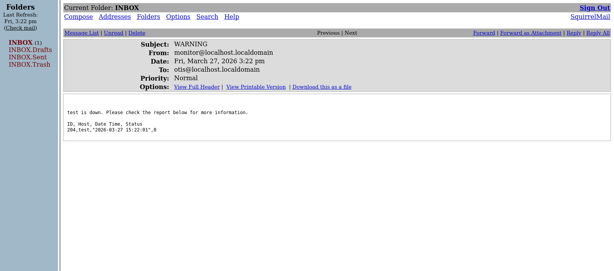
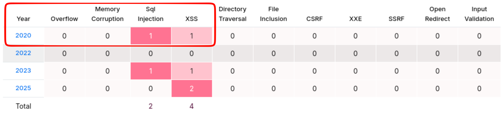

# Scope

This lab requires you to exploit an SQL Injection vulnerability in a monitoring web application to leak hashed credentials, crack them, and gain system access via SSH. Privilege escalation is achieved by extracting and decrypting root credentials stored in Mozilla Firefox local files.

## IP: 192.168.134.124

# Enumeration

## Ports

```bash
PORT   STATE SERVICE REASON
21/tcp open  ftp     syn-ack ttl 61
22/tcp open  ssh     syn-ack ttl 61
```

## Services

```bash
PORT   STATE SERVICE REASON         VERSION
21/tcp open  ftp     syn-ack ttl 61 vsftpd 3.0.2
| ftp-syst:
|   STAT:
| FTP server status:
|      Connected to ::ffff:192.168.45.222
|      Logged in as ftp
|      TYPE: ASCII
|      No session bandwidth limit
|      Session timeout in seconds is 300
|      Control connection is plain text
|      Data connections will be plain text
|      At session startup, client count was 2
|      vsFTPd 3.0.2 - secure, fast, stable
|_End of status
| ftp-anon: Anonymous FTP login allowed (FTP code 230)
|_Can't get directory listing: ERROR
22/tcp open  ssh     syn-ack ttl 61 OpenSSH 7.4 (protocol 2.0)
| ssh-hostkey:
|   2048 85464106da830401b0e41f9b7e8b319f (RSA)
| ssh-rsa AAAAB3NzaC1yc2EAAAADAQABAAABAQDQtHmxxtG4ltyiTASYo7IAAQVLqSkanJ2TSG695Ta5sMaS5eixyvA8ogIMPtXm/iaHRxvCE6I+gxzUpmMD59NpmkAAPW4o0WXXMz0PDxCgUg+sYljlppG91mLyqjghPxygAbhUC4PjezCNtOV9WiiL25Nyb0BpefsFU/BT7bM0NYX3EEdvabDTe/WfE5gKG+GBj6/SOKsFa95bq6xEQrmbj96LieChT0iIkDvaAas6HBf7GPk1kVeLFAU45twWTGNEXpF0a8I+0TdXDp7tD0Gzh2DNWJE/O6c8PJ3jV6WBXXmT353S9FYzki/OxDMaGVAUZtFnSCGzxKVj5YqSWyU7
|   256 e49cb1f244f1f04bc38093a95d9698d3 (ECDSA)
| ecdsa-sha2-nistp256 AAAAE2VjZHNhLXNoYTItbmlzdHAyNTYAAAAIbmlzdHAyNTYAAABBBNRt3iEQF7T82T4vCGDn0qlm9hGE/D2Mzc0UTo01QD0P+6xeY2fs+0/pOuKrA+qbxHmhO5Zn/XvNgx+ay6PYbBI=
|   256 65cfb4afad8656efae8bbff2f0d9be10 (ED25519)
|_ssh-ed25519 AAAAC3NzaC1lZDI1NTE5AAAAIAV1K1EGNhrsQyVvPZ1zVegZIPxuXbZXoK/EU9UAjLrp
80/tcp open  http    syn-ack ttl 61 Apache httpd 2.4.6 ((CentOS) PHP/7.2.33)
|_http-favicon: Unknown favicon MD5: F563215CE087F2F0E494D75B81E07321
| http-methods:
|   Supported Methods: OPTIONS GET HEAD POST TRACE
|_  Potentially risky methods: TRACE
|_http-title: Insanity - UK and European Servers
|_http-server-header: Apache/2.4.6 (CentOS) PHP/7.2.33
Service Info: OS: Unix
```

## FTP

- vsFTPd 3.0.2
- Anonymous logging enabled

```bash
[Mar 19, 2026 - 23:10:21 (+08)] exegol-offsec recon # ftp anonymous@$TARGET
Connected to 192.168.134.124.
220 (vsFTPd 3.0.2)
331 Please specify the password.
Password:
230 Login successful.
Remote system type is UNIX.
Using binary mode to transfer files.
ftp> ls
229 Entering Extended Passive Mode (|||23010|).
ftp: Can't connect to `192.168.134.124:23010': No route to host
200 EPRT command successful. Consider using EPSV.
150 Here comes the directory listing.
drwxr-xr-x    2 0        0               6 Apr 01  2020 pub
226 Directory send OK.
ftp> cd pub
250 Directory successfully changed.
ftp> ls -la
200 EPRT command successful. Consider using EPSV.
150 Here comes the directory listing.
drwxr-xr-x    2 0        0               6 Apr 01  2020 .
drwxr-xr-x    3 0        0              17 Aug 16  2020 ..
226 Directory send OK.
```

- Nothing other than a directory called `pub`.

## HTTP

- Goes to a hosting site


- Email: hello@insanityhosting.vm
  - Domain is possibly insanityhosting.vm
- The site is PHP based.
  - PHP 7.2.3
- 4 main directories that look interesting enough to check
  - /phpmyadmin
    
  - /news
    
    - Potential names that can be used for spraying:
      - Otis
    - Nothing else can be found here.
  - /webmail
     - Used the username "otis" to password spray this login page

        ```bash
        [Mar 27, 2026 - 22:34:10 (+08)] exegol-offsec recon # hydra -l otis -P /opt/lists/rockyou.txt "http-post-form://insanityhosting.vm/webmail/src/redirect.php:login_username=^USER^&secretkey=^PASS^&js_autodetect_results=1&just_logged_in=1:Unknown user or password incorrect"
        Hydra v9.4 (c) 2022 by van Hauser/THC & David Maciejak - Please do not use in military or secret service organizations, or for illegal purposes (this is non-binding, these *** ignore laws and ethics anyway).

        Hydra (https://github.com/vanhauser-thc/thc-hydra) starting at 2026-03-27 22:34:32
        [DATA] max 16 tasks per 1 server, overall 16 tasks, 14344398 login tries (l:1/p:14344398), ~896525 tries per task
        [DATA] attacking http-post-form://insanityhosting.vm:80/webmail/src/redirect.php:login_username=^USER^&secretkey=^PASS^&js_autodetect_results=1&just_logged_in=1:Unknown user or password incorrect
        [80][http-post-form] host: insanityhosting.vm   login: otis   password: 123456
        1 of 1 target successfully completed, 1 valid password found
        Hydra (https://github.com/vanhauser-thc/thc-hydra) finished at 2026-03-27 22:34:41
        ```

        - Credentials for webmail are `otis:123456`
        - Nothing exists in otis's mailbox either

    

  - /monitoring
    - 
  - There's a case of password reuse here. `otis:123456` can be used to login to the monitoring dashboard
    - 
  - Added an IP that doesn't work to run a test. This sends an email to otis's email
    - 
    - 
    - There is the possibility of an injection attack here.

## SSH

- This isn't considered right now as there aren't any available usernames or passwords that can be used to log into the target via SSH

# Exploit

### PHP version exploit with SQLi - Got fixated here for a long while

- Directory busting the site has a changelog that shows up in one of the links

```bash
http://insanityhosting.vm/phpmyadmin/ChangeLog
http://insanityhosting.vm/phpmyadmin/README
http://insanityhosting.vm/phpmyadmin/LICENSE
```

- Reading the changelog shows that the version of phpmyadmin is `5.0.2 (2020-03-20)`
  - There are a couple of vulnerabilities for this version of phpmyadmin, narrowed down to the year 2020: 
    

- Of these, SQLi is the more severe one that has the potential for RCE. The description of this issue on Rapid7 is as follows:

> An issue was discovered in SearchController in phpMyAdmin before 4.9.6 and 5.x before 5.0.3. A SQL injection vulnerability was discovered in how phpMyAdmin processes SQL statements in the search feature. An attacker could use this flaw to inject malicious SQL in to a query.

- This doesn't seem to work directly though.

# Internal Enumeration

# Privilege Escalation

# Remediation

# Lessons Learnt

- Don't get fixated on a quick public exploit. Do the full enumeration first. Then consider the possibly of an exploit written by someone else.
- Often it might involve chaining multiple attacks to get in.
